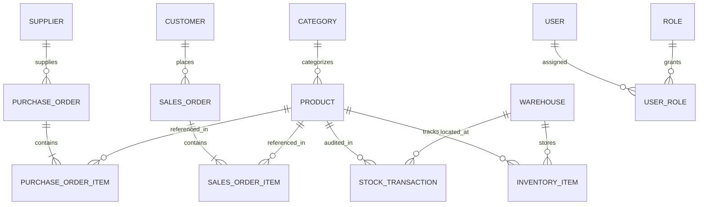
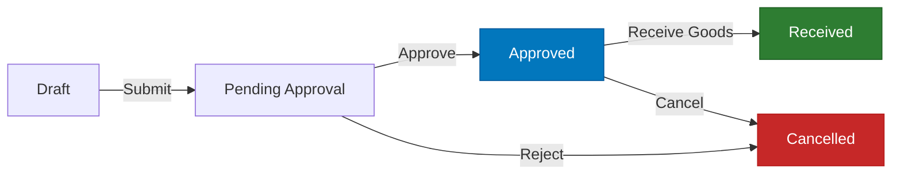
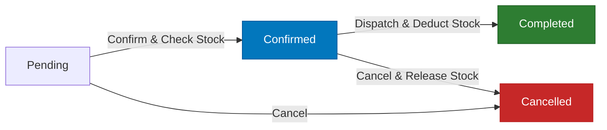

# 📦 Warehouse & Inventory Management System (WMS)

[](https://dotnet.microsoft.com/)
[](https://learn.microsoft.com/en-us/dotnet/csharp/)
[](https://blog.cleancoder.com/uncle-bob/2012/08/13/the-clean-architecture.html)
[](https://github.com/jbogard/MediatR)
[](https://learn.microsoft.com/en-us/ef/core/)
[](https://www.hangfire.io/)
[](https://scalar.com/)
[](tests/)
[](LICENSE)

An enterprise-grade, high-performance **Warehouse & Inventory Management System (WMS)** built with **ASP.NET Core (.NET 8 LTS)** following **Clean Architecture**, **Domain-Driven Design (DDD)** tactical patterns, and **CQRS with MediatR**. 

The system orchestrates multi-warehouse supply chain operations, including procurement through purchase orders, sales order fulfillment, real-time stock allocation and deduction, atomic inter-warehouse transfers, transaction-level auditing, resilient background job processing with Hangfire, and comprehensive business intelligence reports.

---

## 📑 Table of Contents

- [Key Features](#-key-features)
- [Architecture & Design Principles](#-architecture--design-principles)
- [Domain Model & Entity Relationship](#-domain-model--entity-relationship)
- [Business Workflows & State Machines](#-business-workflows--state-machines)
- [Tech Stack](#-tech-stack)
- [Solution Structure](#-solution-structure)
- [API Endpoints Reference](#-api-endpoints-reference)
- [Getting Started & Local Setup](#-getting-started--local-setup)
- [Background Jobs & Automation](#-background-jobs--automation)
- [Validation & Error Handling](#-validation--error-handling)
- [Testing Strategy](#-testing-strategy)
- [Architectural Decisions (Why This and Not That)](#-architectural-decisions)
- [Mentorship & Deep-Dive Companion](#-mentorship--deep-dive-companion)
- [License](#-license)

---

## 🌟 Key Features

### 🏢 Multi-Warehouse & Location Management
- Centralized tracking across distributed physical warehouses.
- Warehouse activation/deactivation safeguards preventing orphaned inventory items.
- Real-time warehouse utilization and capacity metrics.

### 📦 Inventory & Stock Control
- **Atomic Operations**: Atomic Stock-In, Stock-Out, and inter-warehouse Stock Transfers with transactional consistency.
- **Stock Reservations**: Safeguard against overselling by distinguishing between `QuantityOnHand` and `ReservedQuantity`.
- **Immutable Audit Trail**: Every stock change creates a tamper-proof `StockTransaction` record referencing the exact PO, SO, or internal transfer.
- **Optimistic Concurrency**: RowVersion-backed concurrency tokens on inventory items to prevent race conditions during concurrent checkouts or restocks.

### 🛒 Purchase Order (Procurement) Lifecycle
- Full procurement state machine: `Draft` ➔ `PendingApproval` ➔ `Approved` ➔ `Received` (or `Cancelled`).
- Strict domain guardrails: Only approved purchase orders can be received into inventory.
- Automated inventory restock and `StockIn` transaction generation upon receipt.

### 🏷️ Sales Order (Fulfillment) Lifecycle
- Customer order processing state machine: `Pending` ➔ `Confirmed` ➔ `Completed` (or `Cancelled`).
- Stock availability verification and reservation upon order confirmation.
- Automatic inventory deduction and `StockOut` auditing upon completion.
- Reversal of allocated stock if a confirmed order is cancelled.

### 👥 Authentication & Role-Based Access Control (RBAC)
- Clean, domain-driven user and role model with zero external Microsoft Identity coupling.
- Secure password hashing using PBKDF2/cryptographic salting.
- Stateless JWT Bearer token authentication with configurable expiration.
- Granular role authorization: `Admin`, `WarehouseManager`, and `WarehouseStaff`.

### 📊 Advanced Analytics & Business Intelligence
- **Inventory Valuation**: Current stock valuation broken down by product, category, and warehouse.
- **Sales Order Summary**: Revenue metrics, average order value, conversion rates, and top customer rankings.
- **Purchase Order Summary**: Procurement spend analytics, vendor volume, and top supplier rankings.
- **Top-Selling Products**: High-velocity product tracking by units sold and revenue generation.
- **Warehouse Utilization**: Capacity and distribution density analysis across all facilities.

### ⏱️ Resilient Background Processing (Hangfire)
- Out-of-process job execution backed by persistent SQL Server storage.
- **Hourly Low-Stock Check**: Proactive evaluation of stock thresholds triggering automated notifications.
- **Daily Stale Order Cleanup**: Automated expiration of unconfirmed draft/pending orders.
- **Daily Inventory Snapshots**: Scheduled midnight archival of inventory balances for historical trend analysis.
- Interactive, secured dashboard accessible at `/hangfire`.

### 📖 Interactive API Documentation (Scalar)
- Modern, high-performance OpenAPI interface running via **Scalar**.
- Built-in Bearer Token authentication injection and interactive code snippet generation across multiple client languages.

---

## 🏛️ Architecture & Design Principles

The solution strictly adheres to Uncle Bob's **Clean Architecture** and the **Dependency Rule**:

```
                       ┌─────────────────────────┐
                       │   Presentation / API    │
                       └────────────┬────────────┘
                                    │ references
                                    ▼
                       ┌─────────────────────────┐
                       │    Application Layer    │
                       │ (CQRS, MediatR, DTOs)   │
                       └────────────┬────────────┘
                                    │ references
                                    ▼
                       ┌─────────────────────────┐
                       │      Domain Layer       │
                       │  (Entities, Enums,      │
                       │   Business Invariants)  │
                       └─────────────────────────┘
                                    ▲
                                    │ implements interfaces
                       ┌────────────┴────────────┐
                       │   Infrastructure Layer  │
                       │ (EF Core, SQL, Hangfire)│
                       └─────────────────────────┘
```

### Layer Responsibilities

| Layer | Project | Responsibilities & Boundaries |
|---|---|---|
| **Domain** | `WarehouseManagement.Domain` | **Pure Enterprise Business Logic**. Zero external dependencies (no EF Core, no MediatR, no ASP.NET Core). Contains core Entities, Value Objects, Domain Exceptions, Domain Enums, and Auditable Base Entities. |
| **Application** | `WarehouseManagement.Application` | **Use Case Orchestration**. Contains CQRS Commands & Queries, MediatR Handlers, FluentValidation Validators, Pipeline Behaviors (`ValidationBehavior`, `LoggingBehavior`), Application DTOs, and Service Interfaces (`IApplicationDbContext`, `IJwtTokenGenerator`, `ICurrentUserService`, etc.). |
| **Infrastructure** | `WarehouseManagement.Infrastructure` | **External Concerns & I/O**. Implements Application layer abstractions. Houses EF Core `ApplicationDbContext`, Fluent API Configurations, SQL Server Migrations, Hangfire background jobs, BCrypt password hashing, and JWT token issuance. |
| **Presentation** | `WarehouseManagement.API` | **HTTP Entry Point**. ASP.NET Core Web API with thin controllers delegating directly to MediatR. Houses Global Exception Handling Middleware, JWT Bearer configuration, Native OpenAPI, and Scalar documentation. |

---

## 📊 Domain Model & Entity Relationship



---

## 🔄 Business Workflows & State Machines

### 1. Purchase Order Procurement Workflow

> **Core Domain Invariant**: Goods can **only** be received (`Receive`) if the purchase order has been explicitly approved (`Approved`). Receiving automatically updates `InventoryItem.Quantity` and logs an auditable `StockTransaction` of type `StockIn`.

### 2. Sales Order Fulfillment Workflow

> **Core Domain Invariant**: An order cannot be confirmed if any line item exceeds available inventory. On confirmation, stock is reserved. On completion, stock is physically deducted with an immutable `StockOut` audit record.

---

## 🛠️ Tech Stack

| Category | Technology | Purpose |
|---|---|---|
| **Framework** | **ASP.NET Core (.NET 8 LTS)** | Modern, high-performance web framework |
| **Language** | **C# 12** | Latest language features (Records, Primary Constructors, Pattern Matching) |
| **Architecture** | **Clean Architecture + CQRS** | Scalable, decoupled, maintainable enterprise structure |
| **Mediation** | **MediatR (v12)** | In-process messaging for CQRS command/query decoupling |
| **Validation** | **FluentValidation** | Declarative business rules executed via MediatR Pipeline Behavior |
| **ORM** | **Entity Framework Core 9** | Modern ORM with Code-First migrations and Fluent API |
| **Database** | **Microsoft SQL Server** | Enterprise relational database with ACID guarantees |
| **Background Jobs** | **Hangfire** | Persistent, durable background job queue with SQL Server storage |
| **API Documentation** | **Scalar & OpenAPI** | Interactive, elegant API exploration and testing UI |
| **Authentication** | **JWT Bearer (HMAC-SHA256)** | Stateless, token-based authentication and RBAC |
| **Testing** | **xUnit, FluentAssertions, Moq** | Fast unit testing for domain models, CQRS handlers, and jobs |

---

## 📁 Solution Structure

```
d:\.NET Projects\Warehouse & Inventory Management System
├── src/
│   ├── WarehouseManagement.Domain/                 # Core Domain Layer
│   │   ├── Common/                                 # BaseEntity, AuditableEntity
│   │   ├── Entities/                               # Product, Warehouse, PurchaseOrder, SalesOrder...
│   │   ├── Enums/                                  # OrderStatus, StockTransactionType, UserRole...
│   │   └── Exceptions/                             # DomainException, InsufficientStockException...
│   │
│   ├── WarehouseManagement.Application/            # Application Use Cases
│   │   ├── Common/                                 # Interfaces, Models (PaginatedList), Exceptions
│   │   ├── Behaviors/                              # ValidationBehavior, LoggingBehavior
│   │   └── Features/                               # Vertical feature slices (CQRS)
│   │       ├── Auth/                               # Login, Register, Current User
│   │       ├── Categories/                         # Create, Update, Delete, Queries
│   │       ├── Customers/                          # Customer CRUD & Queries
│   │       ├── Inventory/                          # AddStock, RemoveStock, TransferStock, Queries
│   │       ├── Products/                           # Product CRUD, LowStockQueries
│   │       ├── PurchaseOrders/                     # PO State Machine & Items
│   │       ├── Reports/                            # Valuation, Sales/PO Summaries, Utilization
│   │       ├── SalesOrders/                        # SO State Machine & Fulfillment
│   │       ├── Suppliers/                          # Supplier CRUD & Queries
│   │       └── Warehouses/                         # Warehouse CRUD & Management
│   │
│   ├── WarehouseManagement.Infrastructure/         # Persistence & External Services
│   │   ├── BackgroundJobs/                         # Hangfire job implementations
│   │   ├── Identity/                               # PasswordHasher, JwtTokenGenerator
│   │   ├── Persistence/                            # ApplicationDbContext, Migrations
│   │   │   └── Configurations/                     # Fluent API Entity Type Configurations
│   │   └── Services/                               # NotificationService, DateTimeService
│   │
│   └── WarehouseManagement.API/                    # Web API Entry Point
│       ├── Controllers/                            # Thin API Controllers
│       ├── Filters/                                # HangfireAuthorizationFilter
│       ├── Middlewares/                            # ExceptionHandlingMiddleware
│       ├── Program.cs                              # Application composition root
│       └── appsettings.json                        # Configuration & Connection Strings
│
├── tests/
│   ├── WarehouseManagement.UnitTests/              # 144 Comprehensive Unit Tests
│   │   ├── Common/                                 # TestDbContextFactory, TestBase
│   │   ├── Domain/                                 # Invariant & Entity tests
│   │   ├── Features/                               # Command & Query handler tests
│   │   ├── Jobs/                                   # Hangfire job execution tests
│   │   └── Security/                               # Token & Password hashing tests
│   └── WarehouseManagement.IntegrationTests/       # API Integration & WebApplicationFactory tests
│
├── WALKTHROUGH.md                                  # 1500+ lines Senior Mentor Engineering Guide
└── README.md                                       # Master Project Documentation
```

---

## 🔌 API Endpoints Reference

### 🔐 Authentication (`/api/auth`)
| Method | Endpoint | Access | Description |
|---|---|---|---|
| `POST` | `/api/auth/register` | Public | Register a new user account |
| `POST` | `/api/auth/login` | Public | Authenticate and obtain JWT token |
| `GET` | `/api/auth/me` | Authenticated | Retrieve current authenticated user profile |

### 📦 Inventory & Stock Operations (`/api/inventory`)
| Method | Endpoint | Access | Description |
|---|---|---|---|
| `POST` | `/api/inventory/add-stock` | Manager, Staff | Receive new stock into a warehouse (`StockIn`) |
| `POST` | `/api/inventory/remove-stock` | Manager, Staff | Deduct stock with mandatory justification (`StockOut`) |
| `POST` | `/api/inventory/transfer` | Manager | Transfer stock between warehouses atomically |
| `GET` | `/api/inventory/warehouse/{warehouseId}` | Authenticated | View all inventory items in a specific warehouse |
| `GET` | `/api/inventory/product/{productId}` | Authenticated | View stock distribution of a product across all warehouses |
| `GET` | `/api/inventory/transactions` | Authenticated | Query paginated immutable stock audit history |

### 🛒 Purchase Orders (`/api/purchaseorders`)
| Method | Endpoint | Access | Description |
|---|---|---|---|
| `POST` | `/api/purchaseorders` | Manager, Staff | Create a new purchase order (`Draft`) |
| `POST` | `/api/purchaseorders/{id}/items` | Manager, Staff | Add line item to draft purchase order |
| `POST` | `/api/purchaseorders/{id}/submit` | Manager, Staff | Transition order to `PendingApproval` |
| `POST` | `/api/purchaseorders/{id}/approve` | Admin, Manager | Approve order for procurement |
| `POST` | `/api/purchaseorders/{id}/receive` | Manager, Staff | Receive goods into warehouse and restock inventory |
| `POST` | `/api/purchaseorders/{id}/cancel` | Admin, Manager | Cancel purchase order |
| `GET` | `/api/purchaseorders` | Authenticated | Get paginated list of purchase orders with status filtering |
| `GET` | `/api/purchaseorders/{id}` | Authenticated | Get detailed purchase order with items |

### 🏷️ Sales Orders (`/api/salesorders`)
| Method | Endpoint | Access | Description |
|---|---|---|---|
| `POST` | `/api/salesorders` | Manager, Staff | Create a new sales order (`Pending`) |
| `POST` | `/api/salesorders/{id}/items` | Manager, Staff | Add line item to pending sales order |
| `POST` | `/api/salesorders/{id}/confirm` | Manager, Staff | Check stock and transition order to `Confirmed` |
| `POST` | `/api/salesorders/{id}/complete` | Manager, Staff | Dispatch order, deduct inventory, and mark `Completed` |
| `POST` | `/api/salesorders/{id}/cancel` | Manager, Staff | Cancel order and release allocated stock |
| `GET` | `/api/salesorders` | Authenticated | Get paginated sales orders |
| `GET` | `/api/salesorders/{id}` | Authenticated | Get sales order details and line items |

### 📊 Analytics & Reporting (`/api/reports`)
| Method | Endpoint | Access | Description |
|---|---|---|---|
| `GET` | `/api/reports/inventory-valuation` | Admin, Manager | Total inventory valuation grouped by warehouse/category |
| `GET` | `/api/reports/sales-order-summary` | Admin, Manager | Sales revenue, order volume, and top customer rankings |
| `GET` | `/api/reports/purchase-order-summary` | Admin, Manager | Procurement expenditure and top supplier analytics |
| `GET` | `/api/reports/top-selling-products` | Admin, Manager | Ranked fast-moving products by quantity and revenue |
| `GET` | `/api/reports/warehouse-utilization` | Admin, Manager | Capacity and item distribution per warehouse |

### 🏷️ Catalogs & Entities (`/api/products`, `/api/categories`, `/api/suppliers`, `/api/customers`, `/api/warehouses`)
- Comprehensive CRUD, search, pagination, and status management across all foundational entities.

---

## 🚀 Getting Started & Local Setup

### Prerequisites
- [.NET 8.0 SDK](https://dotnet.microsoft.com/download/dotnet/8.0)
- [Microsoft SQL Server](https://www.microsoft.com/sql-server) (or SQL Server Express / LocalDB)
- [Git](https://git-scm.com/)

### 1. Clone Repository
```bash
git clone https://github.com/RahmaAta/WarehouseManagementSystem.git
cd WarehouseManagementSystem
```

### 2. Configure Database Connection
Review or update the database connection string in `src/WarehouseManagement.API/appsettings.json`:
```json
{
  "ConnectionStrings": {
    "DefaultConnection": "Server=localhost;Database=WarehouseManagementDb;Trusted_Connection=True;MultipleActiveResultSets=true;TrustServerCertificate=True"
  }
}
```

### 3. Apply Entity Framework Core Migrations
Apply database schema migrations to initialize SQL Server:
```bash
dotnet ef database update --project src/WarehouseManagement.Infrastructure --startup-project src/WarehouseManagement.API
```

### 4. Build and Run the Application
```bash
dotnet run --project src/WarehouseManagement.API
```

Once running, navigate to:
- **Interactive API Documentation (Scalar)**: [https://localhost:7084/scalar/v1](https://localhost:7084/scalar/v1) or [http://localhost:5294/scalar/v1](http://localhost:5294/scalar/v1)
- **Hangfire Job Dashboard**: [https://localhost:7084/hangfire](https://localhost:7084/hangfire)

---

## ⏱️ Background Jobs & Automation

The system uses **Hangfire** with SQL Server storage to ensure durable, fault-tolerant background execution:

| Job Name | Identifier | Schedule | Description |
|---|---|---|---|
| **Low Stock Notifier** | `low-stock-check-hourly` | `Cron.Hourly` | Scans all products against `MinimumStockLevel` and enqueues warning notifications for warehouse managers. |
| **Stale Order Cleanup** | `stale-order-cleanup-daily` | `Cron.Daily` | Identifies unconfirmed orders that have exceeded retention thresholds and flags them. |
| **Daily Inventory Snapshot** | `daily-inventory-snapshot` | `Cron.Daily(23, 0)` | Takes a snapshot of inventory levels at 11:00 PM UTC for historical trending and valuation audits. |

---

## 🛡️ Validation & Error Handling

### Centralized Pipeline Validation
Requests entering MediatR pass through `ValidationBehavior<TRequest, TResponse>` before executing handlers. Any rule violations caught by FluentValidation immediately short-circuit the pipeline and throw a `ValidationException`.

### Global Exception Handling Middleware
All exceptions are intercepted by `ExceptionHandlingMiddleware` and mapped to standard RFC 7807 **Problem Details**:

```json
{
  "type": "https://tools.ietf.org/html/rfc7231#section-6.5.1",
  "title": "Validation Error",
  "status": 400,
  "detail": "One or more validation failures have occurred.",
  "errors": {
    "Quantity": ["Quantity must be greater than zero."],
    "SKU": ["A product with this SKU already exists."]
  }
}
```

| Exception Type | HTTP Status Code | Description |
|---|---|---|
| `ValidationException` | `400 Bad Request` | Input validation errors with property error breakdown |
| `DomainException` | `400 Bad Request` | Business rule violations (e.g. invalid order state transitions) |
| `InsufficientStockException` | `400 Bad Request` | Attempted stock-out/transfer exceeding available stock |
| `NotFoundException` | `404 Not Found` | Requested entity was not found |
| `UnauthorizedAccessException` | `401 Unauthorized` | Missing or invalid credentials |
| `Exception` | `500 Internal Server Error` | Unexpected unhandled server faults |

---

## 🧪 Testing Strategy

The test suite contains **144 automated unit tests** built with **xUnit**, **Moq**, and **FluentAssertions**:

```bash
dotnet test WarehouseManagement.sln -v minimal
```

```
Passed!  - Failed: 0, Passed: 144, Skipped: 0, Total: 144, Duration: 3.1s
```

### Coverage Highlights:
- **Domain Invariants**: Purchase and Sales Order state machines, stock reservation formulas, negative price guards, and invalid status transition rejections.
- **CQRS Commands & Handlers**: Add Stock, Remove Stock, Inter-Warehouse Transfers, Order Confirmations, and Goods Receipts.
- **Pipeline Behaviors**: Verification of validation short-circuiting and logging dispatching.
- **Reporting & Grouping Calculations**: Verification of client-side LINQ aggregations for revenue, valuation, and vendor spend metrics.
- **Security & Jobs**: Password hasher verifications, JWT expiration tests, and Hangfire job mock executions.

---

## 💡 Architectural Decisions

### 1. Why CQRS + MediatR instead of monolithic Services?
- **Separation of Concerns**: Prevents 3,000-line "God Services" (`InventoryService` with dozens of methods).
- **Single Responsibility**: Each use case is encapsulated in its own Command, Handler, and Validator file.
- **Maintainability**: New features are introduced by adding new handlers without touching existing code (Open/Closed Principle).

### 2. Why Hangfire instead of `IHostedService` / `BackgroundService`?
- **Persistence & Durability**: `IHostedService` with in-memory queues loses all queued notifications if the server restarts. Hangfire persists every job in SQL Server with automated retry and exponential backoff.
- **Observability**: Built-in interactive dashboard for inspecting execution history, retries, and errors in real-time.

### 3. Why Scalar instead of Swagger UI?
- **Modern Developer Experience**: Faster, cleaner API playground with modern aesthetic, instant search, and integrated client SDK generation.
- **Seamless Bearer Token Testing**: Smooth JWT token authentication testing without page reloads.

### 4. Why Client-Side GroupBy in Reporting Handlers?
- **EF Core GroupBy Resilience**: EF Core frequently encounters SQL translation limitations when executing complex `GroupBy` queries with navigation properties. Fetching bounded projection sets via `ToListAsync()` and performing grouping in-memory guarantees deterministic calculation and eliminates runtime query translation exceptions.

---

## 📚 Mentorship & Deep-Dive Companion

Looking for an in-depth senior engineering breakdown? Check out [WALKTHROUGH.md](file:///D:/.NET%20Projects/Warehouse%20&%20Inventory%20Management%20System/WALKTHROUGH.md).

It contains **over 1,500 lines** of detailed architectural explanations, technical interview preparation Q&As, code walk-throughs, and bilingual (English & Egyptian Arabic) pedagogical reasoning written from the perspective of a Senior .NET Architect.

---

## 📄 License

This project is licensed under the [MIT License](LICENSE).
