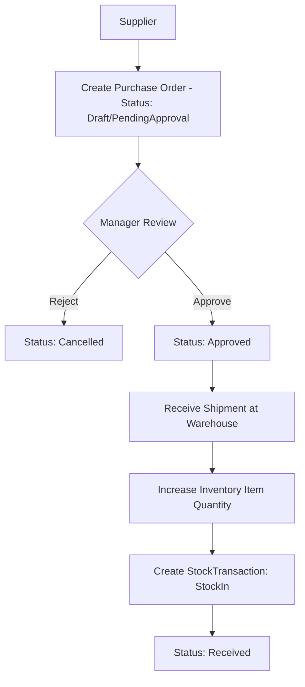
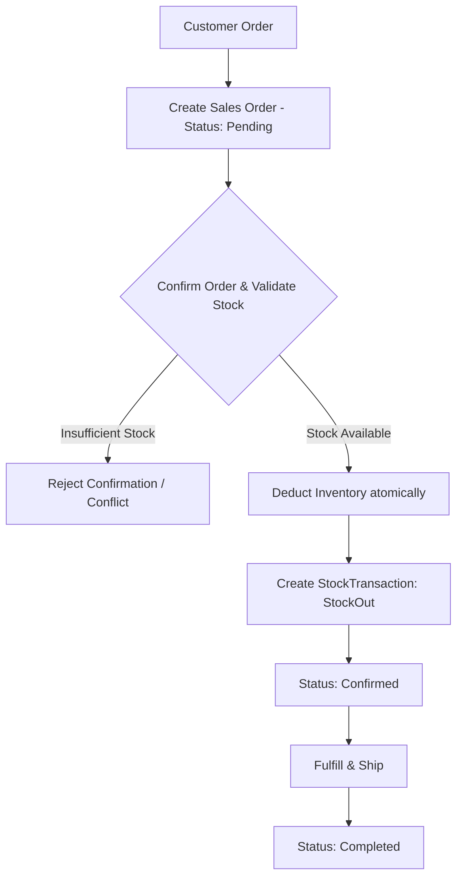
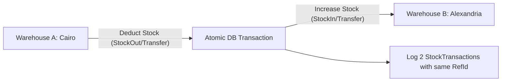
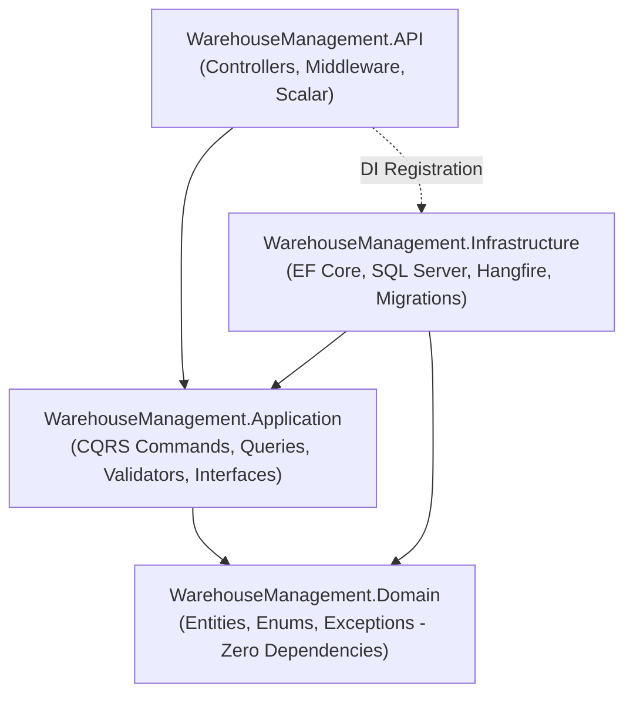

# 📦 Warehouse & Inventory Management System — Master Engineering Walkthrough & Mentor Guide

> **مرحباً بك يا بطل في مشروع التخرج الحقيقي للـ Backend!** 🚀  
> الدليل ده مش مجرد توثيق عادي لكود مكتوب، ده **Mentor Guide** مفصل معمول بأسلوب مهندس برمجيات كبير (Senior .NET Engineer) بيقعد جنبك ويفهمك كل سطر اتكتب ليه، والبدائل كانت إيه، وليه اختارنا القرار ده تحديداً، وازاي تشرحه بثقة في أي Technical Interview.

---

## 📑 جدول المحتويات (Table of Contents)

1. [نظرة عامة على المشروع (Project Overview)](#1-project-overview)
2. [المشكلة البيزنس وسيناريوهات النظام (Business Problem & Flows)](#2-business-problem--flows)
3. [المتطلبات الوظيفية وغير الوظيفية (Functional & Non-Functional Requirements)](#3-requirements)
4. [الأدوار والمستخدمين (Actors & Roles)](#4-actors--roles)
5. [المعمارية النظيفة (Clean Architecture) وقاعدة التبعية](#5-clean-architecture)
6. [مقارنات هندسية حاسمة: Why This and Not That?](#6-why-this-and-not-that)
7. [تصميم الـ Domain Model والـ Database ERD](#7-domain-model--database-erd)
8. [نمط CQRS و MediatR: فصل القراءة عن الكتابة](#8-cqrs--mediatr)
9. [مواصفات الفاليديشن ومفهوم Pipeline Behaviors](#9-validation--pipeline-behaviors)
10. [المعاملات المالية وإدارة المخزون (Database Transactions & Concurrency)](#10-transactions--concurrency)
11. [المهام الخلفية والمجدولة مع Hangfire (Background & Recurring Jobs)](#11-hangfire)
12. [التوثيق التفاعلي للـ API عبر Scalar و OpenAPI](#12-scalar--openapi)
13. [استراتيجية الـ Git والـ Feature Branches](#13-git-workflow)
14. [دليل أسئلة الإنترفيو المتقدمة (Interview Preparation)](#14-interview-preparation)
15. [شرح المرحلة الأولى بالتفصيل (Phase 1: Solution Setup)](#10-phase-1-walkthrough-solution-setup--clean-architecture-in-depth)
16. [شرح المرحلة الثانية بالتفصيل (Phase 2: Core Domain & Business Rules)](#11-phase-2-walkthrough-core-domain-entities--business-rules-in-depth)
17. [شرح المرحلة الثالثة بالتفصيل (Phase 3: Database & EF Core Persistence)](#12-phase-3-walkthrough-database--ef-core-persistence-in-depth)
18. [شرح المرحلة الرابعة بالتفصيل (Phase 4: JWT Authentication & RBAC)](#13-phase-4-walkthrough-jwt-authentication--rbac-in-depth)

---

## 1. Project Overview

النظام ده عبارة عن **Warehouse & Inventory Management System** حقيقي (Enterprise-grade). الهدف منه إدارة سلاسل الإمداد الداخلية للمؤسسات:
- توريد بضائع من موردين خارجيين (**Purchase Orders**).
- متابعة المخزون داخل مستودعات متعددة (**Warehouses & Multi-location Inventory**).
- نقل البضائع بين المستودعات بتدقيق كامل (**Stock Transfers & Transactions**).
- بيع البضائع للعملاء وخصم المخزون أوتوماتيكياً بعد الفحص (**Sales Orders & Stock Deduction**).
- كشف النواقص والتنبيه اليومي قبل نفاد المخزون (**Hangfire Background Jobs & Notifications**).

---

## 2. Business Problem & Flows

### 🛒 1. دورة التوريد والشراء (Purchase Order Flow)

> **قاعدة بيزنس ذهبية:** ممنوع استلام أي بضاعة (`Receive`) في المستودع إلا إذا كانت أمر الشراء معتمد رسمياً (`Approved`). مينفعش الموظف يستلم بضاعة أمر الشراء بتاعها لسه `PendingApproval`.

### 📦 2. دورة البيع وخروج البضاعة (Sales Order Flow)


### 🔄 3. حركة المخزون بين المستودعات (Stock Transfer Flow)

> **قاعدة بيزنس ذهبية:** عملية نقل المخزون لازم تكون **Atomic** جوه `IDbContextTransaction`. لو حصل خصم من القاهرة والكهربا قطعت أو حصل exception قبل ما نضيف في إسكندرية، يحصل **Rollback** فوراً والمخزون ميروحش في الهوا!

---

## 3. Requirements

### المتطلبات الوظيفية (Functional Requirements):
1. **Catalog Management**: منتجات وتصنيفات (Unique SKU, Price >= 0, Soft deletion/Active status).
2. **Partners**: موردين وعملاء مع تتبع السجلات التاريخية.
3. **Warehouses & Inventory**: تتبع كميات كل منتج في كل مستودع، كشف النواقص (MinimumStockLevel).
4. **Transactions Auditing**: كل حركة مخزن (`StockIn`, `StockOut`, `Transfer`) لازم تسجل سجل تاريخي `StockTransaction`.
5. **Orders Lifecycle**: أوامر شراء وبيع تتبع State Machine دقيقة ومحكمة.
6. **Automation**: فحص يومي للمخزون الناقص وتنبيه المديرين عبر وظائف خلفية.

### المتطلبات غير الوظيفية (Non-Functional Requirements):
1. **Clean Code & Maintainability**: الالتزام بالـ Clean Architecture وفصل الاهتمامات.
2. **ACID Transactions & Data Integrity**: منع الأخطاء الناتجة عن الـ Concurrency ونقص المخزون.
3. **High Security**: تأمين الـ API بـ JWT و Role-based Access Control (RBAC).
4. **Thin Controllers**: الـ Controller مبيعملش أي logic نهائي، مجرد وسيط للـ MediatR.
5. **Robust Centralized Error Handling**: منع خروج Stack traces للمستخدمين وتوحيد صيغ الـ Errors.

---

## 4. Actors & Roles

| الـ Role | الصلاحيات الأساسية |
|---|---|
| **Admin** | إدارة المستخدمين، إدارة المنتجات، التصنيفات، المستودعات، والموردين. |
| **WarehouseManager** | إدارة المخزون، الموافقة على أوامر الشراء (`Approve`), الاطلاع على التقارير والنواقص. |
| **WarehouseStaff** | إدخال حركات المخزون المسموحة، استلام البضائع لأوامر الشراء المعتمدة (`Receive`). |

---

## 5. Clean Architecture



### 🧠 القاعدة الذهبية: Dependency Inversion Rule
"الاتجاه دايمًا من الخارج للداخل. الطبقات الداخلية لا تعلم أي شيء عن الطبقات الخارجية."
- الـ **Domain** حر تماماً، لا يعرف Entity Framework، ولا يعرف SQL Server، ولا يعرف HTTP.
- الـ **Application** بتتعامل مع الداتابيز عن طريق **Interfaces** (عقود) زي `IApplicationDbContext` أو `INotificationService`.
- الـ **Infrastructure** هي اللي بتركب وتنفذ العقود دي.

---

## 6. Why This and Not That? (مقارنات تقنية وهندسية)

### ❓ 1. ليه استخدمنا Clean Architecture ومستخدمناش 3-Tier العادية؟
- **ما هي؟**: تقسيم السيستم لطبقات تركز على الـ Business Logic أولاً وليس على الداتابيز.
- **ليه مفيدة في الحقيقة؟**: في الـ 3-Tier التقليدية، الـ Business Layer بتبقى معتمدة على الـ Data Access Layer (EF Core). فلو اتغير الـ ORM أو طريقة التخزين، الـ Business Logic كله بيتأثر. الـ Clean Architecture بتعكس الاتجاه (Dependency Inversion)، وده بيخلي الـ Domain معزول وقابل للاختبار بنسبة 100% بدون أي داتابيز حقيقية.
- **البديل؟**: 3-Tier Architecture أو N-Tier.
- **ليه رفضنا البديل؟**: التماسك العالي والـ Coupling الشديد بين الـ Business Logic والداتابيز، وصعوبة كتابة Unit Tests نقية بدون Mocking معقد لمكتبات الـ ORM.
- **في الإنترفيو**: "Clean Architecture isolates domain rules from infrastructure concerns, making the core enterprise logic testable, maintainable, and independent of external frameworks."

### ❓ 2. ليه استخدمنا CQRS + MediatR بدل Traditional Service Classes؟
- **ما هي؟**: CQRS تعني فصل عمليات القراءة (Queries) عن عمليات التعديل (Commands). واستخدام MediatR بيخلي الـ Controller يبعت Request object وميعرفش مين بينفذه.
- **ليه مفيدة في الحقيقة؟**: في المشاريع الكبيرة، الـ `ProductService` التقليدي بيتحول لـ God Class فيه 40 ميثود، و20 Dependencies محقونة في الـ Constructor. أي تعديل في سطر بيعمل Merge Conflict لكل التيم! مع CQRS، كل ميزة (Feature) ليها فايل مستقل: `AddStockCommand` و `AddStockCommandHandler`.
- **البديل؟**: Service Layer عادي (`IInventoryService`, `IProductService`).
- **ليه رفضنا البديل هنا؟**: لمنع تضخم الـ Services، ولتطبيق مبدأ المسؤولية الفردية (Single Responsibility Principle) بدقة، وتسهيل عمل Pipeline Behaviors للفاليديشن واللوجنج.
- **بالعربي البلدي**: "لو كلنا شغالين في نفس الـ Service كلاس، أي commit هتعمل conflict، ولو ميثود باظت الـ Service كلها بتتهز. مع MediatR، كل Command في علبة لوحده مقفولة عليه."

### ❓ 3. ليه FluentValidation مع PipelineBehavior بدل DataAnnotations؟
- **ما هي؟**: عمل كلاس فاليديشن منفصل (`CreateProductCommandValidator`) بيشتغل أوتوماتيكياً قبل ما الكوماند يوصل للـ Handler عبر `ValidationBehavior`.
- **ليه مفيدة في الحقيقة؟**: الـ DataAnnotations بتلوث الـ DTOs بـ Attributes وبتعجز لما تكون محتاج Async validation (زي إنك تسأل الداتابيز هل الـ SKU ده موجود قبل كده ولا لأ).
- **البديل؟**: `[Required]`, `[MaxLength]` على الـ DTO أو كتابة `if (string.IsNullOrEmpty)` جوه الـ Controller/Handler.
- **ليه رفضنا البديل؟**: الفصل النظيف للمسؤوليات ومنع تكرار كود التحقق في كل Controller.

### ❓ 4. ليه Hangfire للـ Background Jobs بدل Task.Run أو HostedService؟
- **ما هي؟**: محرك مهام خلفية احترافي بيخزن الـ Jobs في الـ SQL Server ويشغلها بره الـ HTTP Request Cycle.
- **ليه مفيدة في الحقيقة؟**: لو استخدمت `Task.Run` والسيرفر اتعمله Restart أو حصل Crash، التاسك هتضيع للأبد! Hangfire بيضمن **Guaranteed Execution**: بيحفظ المهمة في جدول داتابيز، بيعيد المحاولة لو فشلت (Exponential Backoff)، وفيه لوحة تحكم Dashboard ممتازة لرؤية المهام الفاشلة والناجحة.
- **البديل؟**: `IHostedService` / `BackgroundService` مع In-memory Queue، أو `Quartz.NET`.
- **ليه رفضنا البديل؟**: الـ In-memory بتضيع البيانات عند انقطاع الكهرباء/الريستارت، و Quartz.NET إعداده معقد ومفيهوش Dashboard جاهز ومجاني وسريع زي Hangfire.

### ❓ 5. ليه Scalar بدل Swagger UI التقليدي؟
- **ما هي؟**: أداة جيل جديد لعرض وتجربة الـ OpenAPI specs.
- **ليه مفيدة في الحقيقة؟**: واجهة سريعة وعصرية جداً، أسهل في تجربة الـ JWT Bearer Authentication، وتوفر كود جاهز لكل لغات البرمجة لاستدعاء الـ Endpoint بضغطة زر.
- **البديل؟**: Swashbuckle Swagger UI.
- **ليه تم التفضيل؟**: مايكروسوفت نفسها في .NET 9 شالت الاعتماد الافتراضي على Swashbuckle لصالح OpenAPI المباشر و Scalar كأداة عصرية خفيفة وأقوى.

---

## 7. Domain Model & Entities Breakdown

### 1. `Product`
- `Id` (Guid / int)
- `Name` (nvarchar(150))
- `SKU` (nvarchar(50), Unique Index)
- `Price` (decimal(18,2) >= 0)
- `MinimumStockLevel` (int >= 0)
- `CategoryId` (FK)
- `IsActive` (bool)

### 2. `InventoryItem`
- `Id`
- `WarehouseId` (FK)
- `ProductId` (FK)
- `Quantity` (int >= 0)
- `ReservedQuantity` (int >= 0)
- *Unique Constraint*: (`WarehouseId`, `ProductId`)

### 3. `StockTransaction`
- `Id`
- `ProductId` (FK)
- `WarehouseId` (FK)
- `ToWarehouseId` (FK nullable - for transfers)
- `Type` (Enum: StockIn, StockOut, Transfer)
- `Quantity` (int > 0)
- `ReferenceId` (nvarchar(100) - e.g. PO-10023, SO-50012)
- `Notes`
- `CreatedAt` (DateTimeOffset)
- `CreatedByUserId`

### 4. `PurchaseOrder` & `PurchaseOrderItem`
- States: `Draft` ➔ `PendingApproval` ➔ `Approved` ➔ `Received` (or `Cancelled`).
- Includes Items with unit prices and ordered quantities.

### 5. `SalesOrder` & `SalesOrderItem`
- States: `Pending` ➔ `Confirmed` ➔ `Completed` (or `Cancelled`).
- Validates stock at confirmation.

---

## 8. Database Transactions & Concurrency

### 💡 سيناريو واقعي: نقل بضاعة بين مستودعين (Stock Transfer)
تخيل بننقل 50 كرتونة من مستودع القاهرة لمستودع الإسكندرية:
1. لازم نفتح **Database Transaction**:
   ```csharp
   using var transaction = await _context.Database.BeginTransactionAsync(cancellationToken);
   ```
2. نقرأ مخزون القاهرة، نتأكد إنه >= 50.
3. نخصم 50 من القاهرة.
4. نضيف 50 في الإسكندرية.
5. نسجل حركتين في جدول الـ `StockTransactions`.
6. نعمل `await transaction.CommitAsync()`.
7. **لو حصل أي error في الخطوة 4 أو 5؟** الـ `catch` block هينفذ `RollbackAsync()` ويرجع كل حاجة زي ما كانت، ولا حبة رملة تنقص بالغلط!

---

## 9. Git Feature Branch Workflow

من أجل تنظيم العمل مثل الفرق الاحترافية (Senior Engineering Teams)، سنتبع نمط **Conventional Commits**:
- `feat(scope): short description`
- `fix(scope): fix description`
- `docs(scope): documentation update`
- `test(scope): adding unit/integration tests`

### الفروع المخططة للعمل:
1. `feat/01-solution-setup`: هيكل الـ Clean Architecture والمشاريع.
2. `feat/02-domain-core`: كلاسات الـ Entities والـ Enums والـ Business Exceptions.
3. `feat/03-persistence-efcore`: إعدادات الـ EF Core و SQL Server والـ Migrations.
4. `feat/04-auth-jwt`: الـ Authentication والـ Roles.
5. `feat/05-products-categories`: ميزات المنتجات والتصنيفات بـ CQRS.
6. `feat/06-suppliers-warehouses`: إدارة الموردين والمستودعات والـ Soft Delete.
7. `feat/07-inventory-stock`: حركات الإضافة والخصم والتحويل مع الـ Transactions.
8. `feat/08-purchase-orders`: دورة أوامر الشراء والاستلام.
9. `feat/09-sales-orders`: دورة أوامر البيع وخصم المخزون.
10. `feat/10-validation-pipeline`: الـ FluentValidation و Pipeline Behavior.
11. `feat/11-exception-handling`: معالجة الأخطاء المركزية ونماذج الـ Response.
12. `feat/12-hangfire-notifications`: الـ Background Jobs والتنبيهات.
13. `feat/13-recurring-jobs`: الفحص اليومي للنواقص.
14. `feat/14-scalar-docs`: توثيق الـ API بـ Scalar.
15. `feat/15-automated-tests`: الـ Unit Tests والـ Integration Tests.

---

*(سيتم تحديث هذا الدليل مع كل Feature نضيفها ليكون مرجعك الشامل النهائي!)*

---

## 10. Phase 1 Walkthrough: Solution Setup & Clean Architecture In-Depth

### 1. What are we doing? (ماذا نفعل؟)
قمنا بتهيئة بيئة المشروع كاملة وفق معايير الشركات العالمية (Enterprise Standards):
1. تهيئة مستودع Git مع ملف `.gitignore` متكامل للـ .NET.
2. إنشاء فرع عمل مخصص للميزة: `feat/01-solution-setup`.
3. إنشاء ملفات الـ Solution (`WarehouseManagement.sln` و `WarehouseManagement.slnx`).
4. تقسيم النظام إلى 4 مشاريع في مجلد `src` ومشروعين للاختبار في مجلد `tests`:
   - `WarehouseManagement.Domain` (Class Library - .NET 8)
   - `WarehouseManagement.Application` (Class Library - .NET 8)
   - `WarehouseManagement.Infrastructure` (Class Library - .NET 8)
   - `WarehouseManagement.API` (ASP.NET Core Web API مع Controllers - .NET 8)
   - `WarehouseManagement.UnitTests` (xUnit - .NET 8)
   - `WarehouseManagement.IntegrationTests` (xUnit - .NET 8)
5. ضبط الـ Project References الصارمة لمنع أي اختراق لقاعدة التبعية (The Dependency Inversion Rule).
6. تنظيف كافة ملفات القوالب الافتراضية (`Class1.cs` و `WeatherForecastController.cs`).

---

### 2. Why are we doing it? (لماذا نفعل ذلك؟)
المعمارية هي الأساس الذي يقوم عليه المبنى. لو بدأنا كل الكود في مشروع واحد (Monolithic project واحد فيه الـ Controllers بتكلم الـ DbContext مباشرة)، بعد شهرين النظام هيتحول لـ "Big Ball of Mud" (كتلة طين متشابكة). لو حاولت تغير شكل جدول في الداتابيز، الـ API كلها هتقع وتتعطل!

---

### 3. Why is this useful in a real backend? (فائدته في سوق العمل)
في الشركات الكبيرة:
- **توزيع المهام (Team Parallelism)**: مطور يقدر يشتغل على الـ Domain والـ Business Logic، بينما مطور ثاني شغال على الـ Infrastructure والـ SQL Server بدون ما يعطلوا بعض.
- **عزل التبعيات (Dependency Isolation)**: لو ظهرت ثغرة أمنية أو تحديث في مكتبة الـ ORM، التأثير محصور فقط في الـ Infrastructure دون المساس بالبيزنس.

---

### 4. Why did we choose this approach? (لماذا هذا التوجه تحديداً؟)
اخترنا **Clean Architecture** (المعروفة أيضاً بـ Onion Architecture أو Hexagonal Ports & Adapters) لأنها تضع الـ **Domain في المركز المطلق**. المشاريع مقسمة هكذا:
```
API ──► Application ──► Domain ◄── Infrastructure
```
لاحظ السهمين: كل من `Application` و `Infrastructure` يشير إلى `Domain`. الـ Domain لا يشير إلى أي مشروع آخر نهائياً!

---

### 5. What alternatives exist? (ما هي البدائل؟)
1. **Single Project Web API**: وضع كل الكلاسات والـ DbContext والـ Controllers في نفس المشروع.
2. **Traditional 3-Tier Architecture**:
   - `Presentation` (API) ➔ `Business Logic Layer` (BLL) ➔ `Data Access Layer` (DAL).
3. **Vertical Slice Architecture**: تقسيم المشروع حسب الـ Features وليس حسب الطبقات الأفقية.

---

### 6. Why are we NOT using those alternatives here? (لماذا رفضنا البدائل؟)
- **Single Project**: مناسب فقط للـ Proof of Concept (POC) أو مشاريع الهواة، ومستحيل تطبيقه في نظام إدارة مستودعات ومخازن مؤسسي.
- **Traditional 3-Tier**: مشكلتها القاتلة أن الـ BLL تعتمد مباشرة على الـ DAL. يعني لو الـ DAL مستخدم Entity Framework، الـ BLL أصبحت مجبرة تعرف EF Core. لو قررت في المستقبل تستخدم Event Sourcing أو Dapper أو Mongo، هتضطر تعيد كتابة الـ Business Logic كله!
- **Vertical Slice**: نمط ممتاز، لكن Clean Architecture هي المعيار الصناعي الأكثر طلباً وشهرة في سوق عمل الـ .NET ومقابلات العمل (Interviews).

---

### 7. What problem does this approach solve? (ما المشكلة التي يحلها؟)
- **Coupling Hell (التشابك المميت)**: يمنع المطور بدون قصد من كتابة SQL Queries أو استخدام Entity Framework جوه الـ Controller أو جوه الـ Business Entity. الـ Compiler هيرفض أصلاً يعمل Build لأن الـ Project References مش سامحة بده!
- **Testability**: جعل البيزنس قابل للاختبار بنسبة 100% باستخدام Unit Tests بدون الحاجة لتشغيل SQL Server حقيقي.

---

### 8. What could go wrong? (ما الذي قد يفشل وكيف نتجنبه؟)
- **Circular Dependency (التبعية الدائرية)**: لو خليت مشروعيْن يشيروا لبعض (مثلاً `Domain` يشير لـ `Infrastructure` والعكس)، الـ Compiler هيطلع خطأ شهير: `Circular dependency detected`. تجنبنا ذلك عبر جعل `Domain` بمفرده في القاع.
- **Over-Abstraction**: عمل Interfaces لا فائدة منها لمجرد تطبيق النمط. نحن لن ننشئ أي Interface إلا إذا كانت تمثل عزل حقيقي (مثل `IApplicationDbContext`).

---

### 9. What should I remember for an interview? (ماذا تقول في الإنترفيو؟)
> **Interview Question**: "Explain the Dependency Rule in Clean Architecture."
>
> **الإجابة النموذجية**:
> "In Clean Architecture, source code dependencies must point inward, toward higher-level policies. The Domain layer sits at the core with zero external dependencies. The Application layer orchestrates business use cases and defines abstractions (interfaces). The Infrastructure layer implements these abstractions, and the API layer serves purely as an entry point. This guarantees that business logic remains completely independent of frameworks, databases, and UI concerns."

---

## 11. Phase 2 Walkthrough: Core Domain Entities & Business Rules In-Depth

### 1. What are we doing? (ماذا نفعل؟)
قمنا ببناء **قلب النظام (Domain Core)** داخل `WarehouseManagement.Domain`:
1. **Base & Auditable Classes**:
   - `BaseEntity`: يحمل الـ `Id` (الـ Identity).
   - `AuditableEntity`: يحمل `CreatedAt`, `CreatedBy`, `LastModifiedAt`, `LastModifiedBy` للتدقيق المحاسبي والتاريخي لكل صف.
2. **Domain Enums**:
   - `OrderStatus` (`Pending`, `Confirmed`, `Cancelled`, `Completed`).
   - `PurchaseOrderStatus` (`Draft`, `PendingApproval`, `Approved`, `Received`, `Cancelled`).
   - `StockTransactionType` (`StockIn`, `StockOut`, `Transfer`).
   - `UserRoleType` (`Admin`, `WarehouseManager`, `WarehouseStaff`).
3. **Rich Domain Entities (الكيانات الغنية بالبيزنس)**:
   - `Product`, `Category`, `Supplier`, `Customer`, `Warehouse`.
   - `InventoryItem`: إدارة الكميات، الكميات المحجوزة (`ReservedQuantity`)، والـ `RowVersion` للتحكم في التزامن (Concurrency).
   - `StockTransaction`: سجل الحركات غير القابل للتعديل، مع Factory Methods (`CreateStockIn`, `CreateStockOut`, `CreateTransfer`).
   - `PurchaseOrder` & `PurchaseOrderItem`: دورة الشراء، الاعتماد، والاستلام وحساب التكلفة.
   - `SalesOrder` & `SalesOrderItem`: دورة البيع، الفحص، التأكيد، والإكمال.
   - `User` & `Role`: إدارة بيانات المستخدمين والصلاحيات.
4. **Domain Invariant Exceptions**:
   - `DomainException` (Base class).
   - `InsufficientStockException`.
   - `InvalidOrderStateException`.
   - `NegativePriceException`.
   - `SameWarehouseTransferException`.
5. **Unit Tests**:
   - كتابة 11 اختبار وحدة في `WarehouseManagement.UnitTests` للتأكد من حماية الـ Invariants برمجياً.

---

### 2. Why are we doing it? (لماذا نفعل ذلك؟)
في الأنظمة الحقيقية، الـ **Domain Model هو الحارس الأول على صحة البيانات (Data Integrity)**.
لو سمحنا بـ "Anemic Domain Model" (مجرد كلاسات فاضية فيها getters و setters عامة `public set`)، أي مبرمج أو Controller في المستقبل يقدر يكتب:
```csharp
inventoryItem.Quantity = -50; // كارثة! مخزون بالسالب!
purchaseOrder.Status = PurchaseOrderStatus.Received; // استلم بضاعة من غير ما المدير يوافق!
```
لذلك، جعلنا الـ Setters خاصة (`private set`) وكل تعديل يمر من خلال **Domain Methods** تطبق قواعد البيزنس وترمي Exceptions واضحة لو حصل أي انتهاك!

---

### 3. Why is this useful in a real backend? (فائدته في سوق العمل)
- **منع الفساد المالي والمخزني (Preventing State Corruption)**: لا يمكن خروج بضاعة لا نملكها، ولا يمكن استلام شحنة لم يتم اعتماد أمر شرائها.
- **Single Source of Truth**: قاعدة البيزنس مكتوبة مرة واحدة داخل الـ Entity، وليس مكررة في 5 Controllers و 3 Services.
- **سهولة الاختبار (Instant Unit Testing)**: اختبرنا 11 سيناريو معقد في 60 مللي ثانية بدون تشغيل داتابيز وبدون تشغيل الـ API!

---

### 4. Why did we choose this approach? (لماذا هذا التوجه تحديداً؟)
اتبعنا أسلوب **Rich Domain Model** بدلاً من **Anemic Domain Model**:
- الكيان هو المسؤول عن حماية حالته (Encapsulation).
- استخدام الـ Private Setters والدوال الدلالية مثل:
  - `po.MarkAsReceived(staffUser)` بدلاً من `po.Status = 4`.
  - `inventory.ReserveStock(quantity)` بدلاً من حسابات يدوية مبعثرة.

---

### 5. What alternatives exist? (ما هي البدائل؟)
1. **Anemic Domain Model**: كلاسات مجرد DTOs بخصائص `{ get; set; }`، وكل العمليات الحسابية والـ if conditions مكتوبة جوه الـ Services أو الـ Handlers.
2. **Database Triggers / Stored Procedures**: وضع القواعد والتحقق جوه SQL Server مباشرة.

---

### 6. Why are we NOT using those alternatives here? (لماذا رفضنا البدائل؟)
- **Anemic Model**: كابوس في الصيانة! لو احتجت تغير شرط التأكيد، هتدور في المشروع كله على الأماكن اللي بتعدل `Status`.
- **Database Triggers**: صعبة جداً في الـ Version Control والـ Unit Testing، وتربط النظام بمحرك داتابيز محدد وتخفي الـ Business Rules عن أعين المطورين في الـ C#.

---

### 7. What problem does this approach solve? (ما المشكلة التي يحلها؟)
- **Invalid State Transitions**:
  - هل ينفع أمر شراء `Draft` يتحول فجأة لـ `Received`؟ **مستحيل!** الكود هيرمي `InvalidOrderStateException`.
  - هل ينفع نحول بضاعة من مستودع 1 لنفس مستودع 1؟ **مستحيل!** الكود هيرمي `SameWarehouseTransferException`.
  - هل ينفع نبيع منتج بسعر سالب؟ **مستحيل!** الكود هيرمي `NegativePriceException`.

---

### 8. What could go wrong? (ما الذي قد يفشل وكيف نتجنبه؟)
- **EF Core Parameterless Constructor**:
  - الـ EF Core يحتاج إلى Parameterless Constructor لإنشاء الكائنات عند قراءتها من الداتابيز.
  - **الحل**: أضفنا `protected EntityName() { }` في كل كيان ليستخدمها EF Core مع إجبار باقي المطورين على استخدام الـ Public Constructor أو الـ Factory Method.
- **Collections Mutation**:
  - لو عرّفنا الـ Items كـ `public List<SalesOrderItem> Items { get; set; }`، أي شخص من الخارج يقدر يعمل `order.Items.Clear()` ويتجاوز حساب الـ `TotalAmount`!
  - **الحل**: جعلنا الـ List داخلية `private readonly List<T> _items` وعرّفنا الخاصية العامة كـ `IReadOnlyCollection<T> Items => _items.AsReadOnly()`.

---

### 9. What should I remember for an interview? (ماذا تقول في الإنترفيو؟)
> **Interview Question**: "What is the difference between an Anemic Domain Model and a Rich Domain Model?"
>
> **الإجابة النموذجية**:
> "An **Anemic Domain Model** treats entities as plain data containers with getters and setters, pushing all business logic into service layers. This violates OOP encapsulation and leads to duplicated logic. In contrast, a **Rich Domain Model** encapsulates data alongside the business rules and state transitions that govern it (e.g., using private setters, factory methods, and domain invariant methods). This guarantees that an entity can never exist in an invalid state."

---

## 12. Phase 3 Walkthrough: Database & EF Core Persistence In-Depth

### 1. What are we doing? (ماذا نفعل؟)
قمنا بربط النظام بقاعدة بيانات حقيقية **SQL Server** باستخدام **Entity Framework Core 8**:
1. تثبيت الحزم:
   - `Microsoft.EntityFrameworkCore.SqlServer` في `Infrastructure`.
   - `Microsoft.EntityFrameworkCore.Design` في `Infrastructure` و `API`.
   - `Microsoft.EntityFrameworkCore` في `Application`.
2. إنشاء عقد قاعدة البيانات `IApplicationDbContext` داخل `WarehouseManagement.Application` لتمكين الـ Dependency Inversion.
3. بناء `ApplicationDbContext` داخل `WarehouseManagement.Infrastructure` مع ميزة **Automatic Auditing**: يقوم بتحديث `CreatedAt` و `LastModifiedAt` أوتوماتيكياً لكل كيان يرث `AuditableEntity`.
4. كتابة إعدادات **Fluent API** منفصلة لكل كيان في مجلد `Persistence/Configurations/`:
   - Unique Indexes على `SKU`, `Username`, `Email`, `OrderNumber`.
   - Composite Unique Index على `(WarehouseId, ProductId)` لمنع تكرار المنتج في نفس المستودع.
   - تفعيل `RowVersion` كـ **Optimistic Concurrency Token**.
   - ضبط سلوك الحذف `DeleteBehavior.Restrict` لحماية سجلات الحركات المالية والمخزنية من المسح العفوي.
   - تهيئة الأدوار الأساسية (Seed Data) لـ `Roles`.
5. توليد Migration باسم `InitialCreate` وتطبيقها فعلياً على قاعدة بيانات `WarehouseManagementDb` في SQL Server.

---

### 2. Why are we doing it? (لماذا نفعل ذلك؟)
في الـ Clean Architecture، طبقة الـ Application ومسؤولو الـ Use Cases (مثل Handlers) لا يجب أن يعرفوا أي تفاصيل عن نوع الداتابيز المستخدمة (سواء كانت SQL Server أو Oracle).
لذلك، جعلنا الـ Application تعتمد فقط على **Interface** اسمه `IApplicationDbContext`، بينما قامت الـ Infrastructure بتنفيذ هذا الـ Interface واستخدام EF Core و SQL Server تحت الغطاء.

---

### 3. Why is this useful in a real backend? (فائدته في سوق العمل)
- **Zero Framework Leakage**: كود الـ Application والـ Domain لا يحتوي على أي كود خاص بـ SQL Server أو Connection Strings.
- **Data Protection (حماية الحركات المالية)**: في المخازن، لو قمت بحذف مورد (`Supplier`)، من الكارثة أن يُحذف معه تاريخ أوامر الشراء المرتبطة به! ضبط `DeleteBehavior.Restrict` يمنع الـ Cascade Delete العشوائي ويجبر السيستم على الحفاظ على التاريخ المحاسبي كاملاً.
- **Concurrency Protection**: منع حدوث Race Conditions عندما يحاول عميلان شراء آخر قطعة في المخزن في نفس اللحظة عبر الـ `RowVersion`.

---

### 4. Why did we choose this approach? (لماذا هذا التوجه تحديداً؟)
1. **Fluent API بدلاً من DataAnnotations**:
   - DataAnnotations تلوث كلاسات الـ Domain بـ Attributes تابعة للداتابيز مثل `[Column(TypeName = "decimal(18,2)")]`، مما يكسر نقاء الـ Domain.
   - Fluent API تفصل الإعدادات تماماً داخل كلاسات مستقلة (`IEntityTypeConfiguration<T>`) في الـ Infrastructure.
2. **`IApplicationDbContext` بدلاً من Repository Pattern التقليدي لكل Entity**:
   - الـ EF Core في حد ذاته هو تطبيق عملي لنمط **Repository (DbSet) + Unit of Work (DbContext)**.
   - عمل Generic Repository سطحي فوق الـ EF Core (`IRepository<T>` يحتوي على `Add`, `Update`, `Delete`) هو Anti-pattern شائع يسمى **Over-Abstraction**، لأنه يحرمك من إمكانيات EF Core القوية مثل `AsNoTracking()`, `Include()`, والـ Projections بـ `Select()`.

---

### 5. What alternatives exist? (ما هي البدائل؟)
1. **Generic Repository & Unit of Work Layer فوق EF Core**: عمل `GenericRepository<T>` و `UnitOfWork` يغلف الـ DbContext.
2. **Dapper / Raw ADO.NET**: استخدام استعلامات SQL خام ومكتبة Micro-ORM خفيفة.

---

### 6. Why are we NOT using those alternatives here? (لماذا رفضنا البدائل؟)
- **Generic Repository فوق EF Core**: كما شرحنا، الـ DbContext هو بالفعل Unit of Work. إضافة طبقة Generic إضافية بدون داعٍ يضيف Boilerplate كود فقط بدون أي قيمة بيزنس حقيقية. (سنستخدم استراتيجية Repository مخصصة فقط إن وُجدت عملية بيزنس معقدة تتطلب ذلك).
- **Dapper**: ممتاز للـ High-performance Read Queries، لكن EF Core 8 أصبح سريعاً جداً، ويوفر Change Tracking، Migrations، وإدارة العلاقات أوتوماتيكياً وهو الخيار الأساسي لبيئات العمل الحديثة.

---

### 7. What problem does this approach solve? (ما المشكلة التي يحلها؟)
- **Concurrency Overselling (بيع بضاعة غير موجودة)**:
  - عبر `builder.Property(i => i.RowVersion).IsRowVersion()`، كل صف في `InventoryItems` يملك ختم زمني ثنائي `byte[]`.
  - إذا قرأ مستخدمان نفس المخزون وعدّلوه في نفس اللحظة، أول عملية تنجح، والعملية الثانية تفشل بـ `DbUpdateConcurrencyException` فوراً، مما يمنع بيع نفس السلعة مرتين!
- **Composite Unique Index**:
  - يضمن فيزيائياً داخل SQL Server ألا يوجد صفان يحملان نفس `WarehouseId` و `ProductId`.

---

### 8. What could go wrong? (ما الذي قد يفشل وكيف نتجنبه؟)
- **Cascade Delete Accidental Data Loss**:
  - الإعداد الافتراضي في EF Core للعلاقات الإجبارية هو `Cascade Delete`. لو حذف موظف مستودعاً، كانت كل المنتجات وحركات المخزن ستُحذف معه!
  - **الحل**: قمنا بضبط `DeleteBehavior.Restrict` صراحة على كل العلاقات الحساسة.
- **Decimals Truncation**:
  - لو لم تحدد `HasPrecision(18, 2)` للأسعار، SQL Server سيصدر تحذيراً وقد يقرّب الأرقام إلى خانتين غير دقيقتين. قمنا بضبط الدقة المالية لجميع حقول الأسعار والإجماليات.

---

### 9. What should I remember for an interview? (ماذا تقول في الإنترفيو؟)
> **Interview Question**: "Why use Fluent API over Data Annotations in Clean Architecture, and why is DbContext considered a Unit of Work?"
>
> **الإجابة النموذجية**:
> "In Clean Architecture, the Domain layer must remain pure and free of infrastructure concerns. Using Fluent API in the Infrastructure layer isolates database mappings (indexes, constraints, precision) from entity definitions. Furthermore, EF Core's `DbContext` inherently implements the **Unit of Work** pattern (coordinating multiple repository/DbSet operations within a single transaction during `SaveChangesAsync`), while `DbSet<T>` serves as the **Repository**. Wrapping EF Core in a generic repository often introduces unnecessary abstraction, hiding valuable capabilities like projections and async query streaming."

---

## 13. Phase 4 Walkthrough: JWT Authentication & RBAC In-Depth

### 1. What are we doing? (ماذا نفعل؟)
قمنا ببناء منظومة الأمان والتحقق من الهوية والصلاحيات بالكامل:
1. **تثبيت حزم الأمان**:
   - `System.IdentityModel.Tokens.Jwt` و `Microsoft.AspNetCore.Cryptography.KeyDerivation` في الـ `Infrastructure`.
   - `Microsoft.AspNetCore.Authentication.JwtBearer` في الـ `API`.
   - `MediatR` في الـ `Application`.
2. **عقود الأمان المجردة في Application**:
   - `IPasswordHasher`: لتشفير وفحص كلمات المرور.
   - `IJwtTokenGenerator`: لتوليد التوكن الرقمي الموقّع ومرفق به Claims المستخدم ودوره.
   - `ICurrentUserService`: للوصول لبيانات المستخدم الحالي والـ Role من سياق الطلب.
3. **أول ميزات CQRS عبر MediatR**:
   - `RegisterUserCommand` & `RegisterUserCommandHandler`: فحص عدم تكرار اسم المستخدم والبريد، تشفير كلمة المرور بـ Salt عشوائي، حفظ المستخدم، وتوليد التوكن.
   - `LoginCommand` & `LoginCommandHandler`: التحقق من صحة الحساب وكونه مفعلاً، ومقارنة الـ Hash، وتوليد التوكن.
4. **تشفير كلمات المرور في Infrastructure**:
   - استخدام خوارزمية **PBKDF2** (HMAC-SHA256 مع 100,000 تكرار و 128-bit salt) والمقارنة بـ `FixedTimeEquals` لمنع هجمات التوقيت (Timing Attacks).
5. **تأمين الـ API و Middleware**:
   - ضبط `JwtBearerOptions` في `Program.cs`.
   - ترتيب الـ Middleware الصحيح: `app.UseAuthentication()` قبل `app.UseAuthorization()`.
   - إنشاء `AuthController` بـ Endpoints للتسجيل، الدخول، وتجربة الـ `[Authorize]`.
6. **Unit Tests للأمان**:
   - إضافة 7 اختبارات وحدة لفحص تشفير كلمات المرور وتوليد التوكن والتأكد من وجود الـ Claims الصحيحة.

---

### 2. Why are we doing it? (لماذا نفعل ذلك؟)
في أنظمة الـ Backend، لا يمكن أن نثق في أي طلب قادم من الإنترنت دون معرفة:
- **من أنت؟ (Authentication - التحقق من الهوية)**.
- **ما هي صلاحياتك؟ (Authorization - التفويض والصلاحيات)**.
في نظام المستودعات، لا يجوز لموظف عادي (`WarehouseStaff`) أن يعتمد أمر شراء (`Approve Purchase Order`) أو يضيف مستخدماً جديداً؛ هذه صلاحيات حصرية لـ `WarehouseManager` و `Admin`.

---

### 3. Why is this useful in a real backend? (فائدته في سوق العمل)
- **Stateless Architecture**: الـ JWT يجعل السيرفر Stateless؛ السيرفر لا يحتاج لحفظ جلسات (Sessions) في الذاكرة (RAM). التوكن مشفر وموقّع رقمياً، ويحتوي على الـ Claims اللازمة، مما يتيح عمل Scale للـ API على 10 سيرفرات مختلفة دون مشاكل تزامن الجلسات.
- **Role-Based Protection**: حماية الـ Endpoints بسهولة عبر Attributes مثل:
  ```csharp
  [Authorize(Roles = "Admin,WarehouseManager")]
  ```

---

### 4. Why did we choose this approach? (لماذا هذا التوجه تحديداً؟)
1. **PBKDF2 مع Salt عشوائي بدلاً من Plain Text أو MD5/SHA256 البسيط**:
   - تشفير الباسورد بـ SHA256 فقط معرض لـ Rainbow Table Attacks (جداول كلمات السر المحسوبة مسبقاً).
   - الـ Salt العشوائي يجعل كل هاش فريداً حتى لو اختار مستخدمان نفس كلمة المرور تماماً.
   - الـ 100,000 تكرار (Iterations) تبطئ هجمات الـ Brute Force بالمليارات!
2. **Custom Lightweight Auth بدلاً من ASP.NET Identity الضخم**:
   - حافظنا على الـ Domain خالياً من الاعتماد على مكتبات مايكروسوفت الثقيلة، ولدينا تحكم كامل في جداول `Users` و `Roles`.

---

### 5. What alternatives exist? (ما هي البدائل؟)
1. **Cookie-based Session Authentication**: حفظ SessionId في الكوكيز وتخزين الجلسة في السيرفر أو Redis.
2. **OAuth2 / OpenID Connect Server خارجي**: مثل Duende IdentityServer أو Auth0 أو Keycloak.

---

### 6. Why are we NOT using those alternatives here? (لماذا رفضنا البدائل؟)
- **Cookie Sessions**: سيئة للـ REST APIs التي تخدم تطبيقات الموبايل والـ Single Page Applications (SPAs)، وتتطلب حفظ حالة (Stateful).
- **External Identity Server (Auth0 / Keycloak)**: حل ممتاز للأنظمة العملاقة (Microservices)، لكن لمشروعنا واستعراض مهارات الـ Backend في المقابلات، بناء الـ JWT المدمج يظهر فهمك العميق لكيفية بناء الـ Security Pipeline بأكمله.

---

### 7. What problem does this approach solve? (ما المشكلة التي يحلها؟)
- **Timing Attacks (هجمات التوقيت)**:
  - عند مقارنة الهاش بـ `if (hash == expectedHash)`، المقارنة تقف عند أول حرف خطأ، مما يمكن المخترق من قياس سرعة الاستجابة بالنانو ثانية لمعرفة الحروف الصحيحة!
  - **الحل**: استخدمنا `CryptographicOperations.FixedTimeEquals` لمقارنة السلاسل المشفرة في زمن ثابت دائماً.

---

### 8. What could go wrong? (ما الذي قد يفشل وكيف نتجنبه؟)
- **Middleware Order Bug (كارثة ترتيب الـ Middleware)**:
  - لو وضعت `app.UseAuthorization()` قبل `app.UseAuthentication()`، السيستم سيفشل في قراءة الـ Token وسيعتبر كل المستخدمين غير مسجلين ويرجع `401 Unauthorized` دائماً!
  - **القاعدة الذهبية**: "مينفعش أقرر صلاحياتك (Authorization) قبل ما أعرف أنت مين أصلاً (Authentication)!"
- **Secret Key Weakness**:
  - استخدام مفتاح سري قصير يسبب خطأ فوري في مكتبة `Microsoft.IdentityModel.Tokens`؛ لأن خوارزمية HMAC-SHA256 تتطلب مفتاحاً لا يقل عن 256 بت (32 حرفاً على الأقل).

---

### 9. What should I remember for an interview? (ماذا تقول في الإنترفيو؟)
> **Interview Question**: "Explain the difference between Authentication and Authorization, and how JWT works in ASP.NET Core."
>
> **الإجابة النموذجية**:
> "**Authentication** is verifying *who you are* (e.g., via username and password), whereas **Authorization** is verifying *what you are allowed to do* (e.g., checking if your Role allows approving a purchase order).  
> A **JWT** consists of three Base64Url-encoded parts: Header (algorithm), Payload (claims like UserId and Role), and Signature (signed with a secret key). When a client sends the token in the `Authorization: Bearer <token>` header, the `JwtBearerMiddleware` validates the signature, lifetime, and issuer using `TokenValidationParameters`, and constructs a `ClaimsPrincipal` attached to `HttpContext.User`. This enables role checks via `[Authorize(Roles = "...")]` in a completely stateless manner."

---

### 💡 ترقية استثنائية: .NET 10.0 Target Framework & Native OpenAPI
تمت ترقية جميع مشاريع الحل الستة لاستهداف **`.NET 10.0`**:
- استبدال مكتبة `Swashbuckle.AspNetCore` القديمة بمنظومة **Native OpenAPI** الرسمية من مايكروسوفت (`builder.Services.AddOpenApi()` و `app.MapOpenApi()`).
- دمج **Scalar API Reference** مع الـ Native OpenAPI لتوليد التوثيق والتجربة التفاعلية في المسار `/scalar`.
- التحقق من عمل كافة اختبارات الـ Unit Tests (18 اختباراً) بنجاح فائق تحت Runtime الـ .NET 10.

---

## 14. Phase 5: Products & Categories Feature (إدارة المنتجات والتصنيفات)

### 1. What was done? (ما الذي تم إنجازه؟)
1. **Generic Pagination Model (`PaginatedList<T>`)**:
   - بناء مغلف عام للصفحات يدعم `PageNumber`، `PageSize`، `TotalPages`، و `TotalCount` مع خصائص الملاحة `HasPreviousPage` و `HasNextPage`، وتوليد الصفحات بكفاءة عبر `Skip` و `Take` على مستوى قاعدة البيانات (SQL Server).
2. **Categories CQRS (إدارة التصنيفات)**:
   - **Commands**:
     - `CreateCategoryCommand`: إنشاء تصنيف جديد مع فحص منع تكرار الاسم (Case-Insensitive).
     - `UpdateCategoryCommand`: تحديث بيانات التصنيف مع منع تكرار الاسم مع تصنيفات أخرى.
     - `DeleteCategoryCommand`: فرض قاعدة العمل (Business Guard): منع حذف أي تصنيف يحتوي على منتجات مرتبطة به لحماية التكامل المرجعي.
   - **Queries**:
     - `GetCategoriesQuery`: جلب التصنيفات مع إحصاء عدد المنتجات التابعة لكل تصنيف (`ProductsCount`) مع خيار تصفية التصنيفات النشطة فقط.
     - `GetCategoryByIdQuery`: جلب تصنيف محدد بالـ ID.
3. **Products CQRS (إدارة المنتجات والمخزون المتاح)**:
   - **Commands**:
     - `CreateProductCommand`: التحقق من وجود التصنيف والتأكد من فرادية الرمز التعريفي (`SKU`) عبر النظام ككل وتغليف قواعد الكيان (السعر والحد الأدنى).
     - `UpdateProductCommand`: تعديل بيانات المنتج وفحص عدم تكرار الـ SKU مع منتج آخر.
     - `DeleteProductCommand`: تنفيذ قاعدة أمان المستودعات: منع حذف أو تعطيل أي منتج لديه رصيد فعلي في المستودع (`Quantity > 0`). إذا كان الرصيد صفراً، يتم الحذف المنطقي الآمن (`Soft Delete`) عبر استدعاء `product.Deactivate()` للحفاظ على سجلات الفواتير وأوامر الشراء التاريخية.
     - `ActivateProductCommand`: إعادة تفعيل المنتجات المعطلة.
   - **Queries**:
     - `GetProductsQuery`: استعلام متطور يدعم الترقيم (`Pagination`)، الفلترة حسب التصنيف (`CategoryId`)، البحث في الاسم أو الـ SKU، وتصفية المنتجات النشطة، مع حساب إجمالي المخزون المتاح (`TotalAvailableStock = Quantity - ReservedQuantity`) على مستوى الـ Query في قاعدة البيانات.
     - `GetProductByIdQuery`: جلب تفاصيل المنتج بالـ ID.
     - `GetProductBySkuQuery`: البحث السريع بالـ SKU لدعم قارئات الباركود المحمولة (`Barcode Handheld Scanners`).
4. **Global Exception Handling Middleware**:
   - بناء `ExceptionHandlingMiddleware` في طبقة الـ API واعتراض كافة الاستثناءات وتحويلها إلى استجابات قياسية وفق معيار RFC 7807 (`ProblemDetails`):
     - `KeyNotFoundException` ➡️ `404 Not Found`
     - `DomainException` / `InvalidOperationException` / `ArgumentException` ➡️ `400 Bad Request`
     - `UnauthorizedAccessException` ➡️ `403 Forbidden`
     - `Exception` العام ➡️ `500 Internal Server Error` مع تسجيل الـ Logs.
5. **RESTful Controllers with RBAC**:
   - `CategoriesController`: عمليات القراءة متاحة، وعمليات التعديل والحذف والإضافة محمية بصلاحيات `[Authorize(Roles = "Admin,WarehouseManager")]`.
   - `ProductsController`: ترقيم، فلترة، بحث، قراءة باركود (`/api/products/sku/{sku}`)، حماية العمليات التعديلية بـ RBAC.
6. **Automated Unit Testing Suite**:
   - دمج `Microsoft.EntityFrameworkCore.InMemory` لاختبار الـ Handlers بقواعد بيانات معزولة تماماً في الذاكرة.
   - إضافة 16 اختبار وحدة جديد (7 للتصنيفات + 9 للمنتجات) لتصل حصيلة الاختبارات إلى **34 اختباراً ناجحاً بنسبة 100%**.

---

### 2. Why are we doing it? (لماذا نفعل ذلك؟)
- المنتجات والتصنيفات هي القلب التجاري والتشغيلي لأي نظام إدارة مستودعات (WMS).
- بدون إدارة مرنة ومحمية للمنتجات، لا يمكن إنشاء أوامر شراء (`Purchase Orders`)، أوامر بيع (`Sales Orders`)، أو تتبع المخزون في الرفوف والأماكن (`Warehouse Locations`).

---

### 3. Why is this useful in a real backend? (فائدته في سوق العمل)
- **High-Performance Pagination**: إذا كان لديك 500,000 منتج في المستودع، جلب المنتجات دفعة واحدة إلى الذاكرة (`context.Products.ToList()`) كفيل بإسقاط السيرفر باستهلاك هائل للـ RAM! استخدام `Skip` و `Take` يضمن أن قاعدة البيانات ترجع فقط الـ 10 أو 20 سجلاً المطلوبة.
- **Data Integrity & Soft Deletes**: في الحياة الواقعية، لا يمكنك أبداً عمل `Hard Delete` لمنتج بيع منه 1000 قطعة العام الماضي؛ لأن حذفه سيكسر السجلات الضريبية والمالية وأوامر البيع التاريخية! لذلك الحذف المنطقي (`Deactivate`) هو المعيار المعتمد عالمياً.
- **Barcode Scanner Integration**: في المستودعات اللوجستية، العمال لا يبحثون بالـ ID الداخلي لقاعدة البيانات، بل يمسحون الباركود بجهاز المسح الضوئي؛ توفير `GetBySku` يلبي هذا الاحتياج الصناعي الحرج.

---

### 4. Why did we choose this approach? (لماذا هذا التوجه تحديداً؟)
1. **CQRS Separations for Clean Evolution**:
   - فصل استعلام المنتجات (`GetProductsQuery`) عن أوامر التعديل (`CreateProductCommand`) يسمح بتحسين الـ Projection والاستعلامات دون المساس بمنطق العمل (Domain Invariants).
2. **Server-Side Projection via EF Core**:
   - حساب المخزون المتاح تم عبر:
     ```csharp
     p.InventoryItems.Sum(i => (int?)(i.Quantity - i.ReservedQuantity)) ?? 0
     ```
     مما يجعل SQL Server هو من يقوم بالعملية الحسابية ويُرجع رقماً جاهزاً للـ API دون تحميل مئات كائنات `InventoryItem` في الذاكرة.
3. **RFC 7807 Standard Error Responses**:
   - بدلاً من إرجاع رسائل خطأ عشوائية، اعتمدنا معيار `ProblemDetails` الرسمي عالمياً في الـ REST APIs.

---

### 5. What alternatives exist? (ما هي البدائل؟)
1. **Hard Delete مباشرة من الجدول (`context.Products.Remove(product)`)**.
2. **Client-Side Filtering & Pagination**: جلب جميع البيانات ثم عمل `.Skip().Take()` في كود الـ C#.
3. **Controller-Heavy Architecture**: كتابة الـ Queries وفحوصات الـ Validation داخل الـ Controller مباشرة بدون MediatR.

---

### 6. Why are we NOT using those alternatives here? (لماذا رفضنا البدائل؟)
- **Hard Delete**: كارثي في أنظمة الـ ERP والـ WMS؛ يسبب أخطاء `Foreign Key Constraint Violation` أو فقدان تاريخ الحركات المخزنية والمالية.
- **Client-Side Pagination**: غير قابل للتوسع (Non-scalable)؛ مع نمو حجم الكتالوج سيؤدي إلى OutOfMemoryException وبطء شديد في الاستجابة.
- **Controller-Heavy**: ينتهك Clean Architecture ومبادئ الـ Single Responsibility، ويجعل كتابة الـ Unit Tests شبه مستحيلة دون تشغيل الـ HTTP Pipeline كاملاً.

---

### 7. What problem does this approach solve? (ما المشكلة التي يحلها؟)
- **Ghost Deletions of Physical Inventory**:
  - منع حذف أو إيقاف منتج ما زال المستودع يحتوي على بضاعة فعلية منه على الأرفف، مما يحمي النظام من ضياع تتبع البضاعة الملموسة.
- **Duplicate SKU Collision**:
  - فحص الـ SKU قبل الحفظ يمنع الخلط بين البضائع في المستودع ويمنع حدوث أخطاء استلام بضائع موردين مختلفين.

---

### 8. What could go wrong? (ما الذي قد يفشل وكيف نتجنبه؟)
- **EF Core Translation Failure with Unmapped Properties**:
  - لو استخدمنا خاصية C# غير معرّفة في جداول الداتابيز (مثل `i.AvailableQuantity`) داخل جملة `Select` في استعلام `IQueryable`، سيفشل محرك EF Core في ترجمتها إلى SQL ويطلق `InvalidOperationException`.
  - **الحل الهندسي**: استخدام الأعمدة الحقيقية المعرفة في قاعدة البيانات `(i.Quantity - i.ReservedQuantity)` داخل الاستعلامات المباشرة.
- **Race Condition on SKU Generation**:
  - قد يحاول مستخدمان إنشاء منتجين بنفس الـ SKU في نفس اللحظة.
  - **الحل الهندسي**: بالإضافة لفحص الـ Application Layer، يوجد `Unique Index` صريح على مستوى SQL Server تم بناؤه في `ProductConfiguration` بالـ Fluent API في Phase 3 كخط دفاع أخير وقاطع.

---

### 9. What should I remember for an interview? (ماذا تقول في الإنترفيو؟)
> **Interview Question**: "How do you design a high-throughput catalog query and handle deletion safely in an enterprise Warehouse System?"
>
> **الإجابة النموذجية**:
> "For catalog queries with large datasets, we enforce **database-level offset pagination** (`Skip` and `Take`) using a generic `PaginatedList<T>`, combining projection with server-side aggregation so only the requested page of DTOs is transferred over the wire without loading heavy entity graphs.  
> For deletion, an enterprise system must never perform physical (hard) deletes on catalog items that are tied to audit logs, ledger transactions, or order lines. Instead, we enforce a domain guard checking if physical stock is still on hand (`Quantity > 0`); if clear, we apply **Soft Deletion** via `product.Deactivate()`. This preserves referential integrity, historical financial reporting, and audit trails while hiding deactivated products from daily operations."

---

## 15. Phase 6: Warehouses & Inventory Management (إدارة المستودعات والعمليات المخزنية)

### 1. What was done? (ما الذي تم إنجازه؟)
1. **Warehouses CQRS (إدارة المستودعات)**:
   - **Commands**:
     - `CreateWarehouseCommand`: إنشاء مستودع جديد مع التحقق الصارم من عدم تكرار الاسم.
     - `UpdateWarehouseCommand`: تعديل بيانات المستودع وموقعه الجغرافي.
     - `DeleteWarehouseCommand`: فرض قاعدة عمل أمان المستودعات: **منع إغلاق أو حذف أي مستودع لا يزال يحتوي على بضاعة فعلية (`Quantity > 0`)**. إذا كان رصيده صفراً، يُنفذ الحذف المنطقي (`Deactivate`).
     - `ActivateWarehouseCommand`: إعادة تنشيط المستودعات المعطلة.
   - **Queries**:
     - `GetWarehousesQuery`: جلب المستودعات مع حساب إجمالي عدد المنتجات المخزنة وعدد الوحدات الإجمالي (`TotalStockUnits`).
     - `GetWarehouseByIdQuery`: استعلام مستودع محدد.
     - `GetWarehouseStockQuery`: استعلام مرقم (`Paginated`) لكافة المنتجات والأرصدة الحرة داخل مستودع معين مع دعم البحث.
2. **Inventory Stock Operations CQRS (العمليات المخزنية وسجل الحركات)**:
   - **Commands**:
     - `AddStockCommand`: إضافة رصيد بضاعة لمستودع محدد، وإنشاء سجل `InventoryItem` جديد تلقائياً إذا كان أول تخزين للمنتج، وتسجيل حركة في دفتر الأستاذ الرقمي (`StockTransaction.CreateStockIn`) مع توثيق اسم المستخدم المنفذ.
     - `RemoveStockCommand`: سحب أو إعدام بضاعة تالفة، مع استدعاء دالة الكيان `RemoveStock` التي تضمن عدم سحب كمية أكبر من الرصيد الحر المتاح، وتسجيل حركة (`StockOut`).
     - `TransferStockCommand`: تحويل بضاعة بين مستودعين بصورة ذرية (`Atomic Database Transaction`). منع التحويل لنفس المستودع (`SameWarehouseTransferException`)، خصم من المصدر، إضافة للهدف، وتسجيل حركة تحويل (`StockTransaction.CreateTransfer`).
   - **Queries**:
     - `GetProductStockQuery`: عرض التوزيع الجغرافي لرصيد منتج معين عبر جميع مستودعات الشركة.
     - `GetStockTransactionsQuery`: دفتر الأستاذ للتدقيق والمراجعة (`Audit Trail`) لعرض تاريخ كافة الحركات المخزنية مع الفلترة بالمنتج أو المستودع.
3. **Concurrency & Exception Middleware Enhancement**:
   - تحديث `ExceptionHandlingMiddleware` لاصطياد استثناء التزامن في EF Core (`DbUpdateConcurrencyException`) وترجمته لـ HTTP `409 Conflict`، بالإضافة للاصطياد الأوتوماتيكي لـ `SameWarehouseTransferException` و `InsufficientStockException`.
4. **RESTful API Controllers with RBAC**:
   - `WarehousesController`: إدارة المرافق والمخزون الداخلي (`/api/warehouses/{id}/stock`) محمية بصلاحيات المديرين.
   - `InventoryController`: عمليات الإضافة والسحب والتحويل، واستعلامات التوزيع وسجل العمليات (`/api/inventory/transactions`).
5. **Testing Suite (قواعد بيانات In-Memory)**:
   - إضافة 19 اختبار وحدة جديد، لترتفع الحصيلة الإجمالية إلى **53 اختباراً بنسبة نجاح 100%**.

---

### 2. Why are we doing it? (لماذا نفعل ذلك؟)
- الكتالوج وحده (المنتجات والتصنيفات) مجرد قائمة أسعار وبيانات وصفية. القيمة الحقيقية للـ WMS تبدأ عندما نعرف: **أين توجد هذه المنتجات فعلياً، وبأي كمية، وما هي حركة دخول وخروج كل قطعة؟**
- تتبع المخزون في مستودعات متعددة (Multi-Warehouse) هو المعيار الأساسي للشركات المتوسطة والعملاقة التي تمتلك مراكز توزيع وفروعاً جغرافية متعددة.

---

### 3. Why is this useful in a real backend? (فائدته في سوق العمل)
- **Immutable Ledger / Audit Trail (دفتر أستاذ غير قابل للتعديل)**:
  - في المحاسبة وإدارة المخازن، لا يجوز تعديل رقم المخزون في الجدول (`Quantity = 50`) دون معرفة: *من عدله؟ متى؟ ولماذا؟ وما هو رقم المستند المرجعي؟*
  - جدول `StockTransactions` يوفر تتبعاً جنائياً دقيقاً لكل حركة (Stock In, Stock Out, Transfer).
- **Atomic Stock Transfers (التحويل الذري)**:
  - لو قمت بسحب 100 قطعة من "مستودع القاهرة" لإرسالها لـ "مستودع الإسكندرية"، وحدث انقطاع في الكهرباء أو خطأ في الداتابيز قبل الإضافة للإسكندرية، بدون `Database Transaction` ستضيع الـ 100 قطعة في الهواء! الترانزاكشن تضمن: **إما أن تكتمل الحركتان معاً، أو يتم التراجع التام (Rollback)**.

---

### 4. Why did we choose this approach? (لماذا هذا التوجه تحديداً؟)
1. **Rich Domain Encapsulation**:
   - منطق التحقق من كفاية المخزون موجود داخل دالة `item.RemoveStock(quantity)` داخل كيان `InventoryItem`، وليس مبعثراً في الـ Controllers أو Handlers.
2. **Optimistic Concurrency with `RowVersion`**:
   - تجنب إقفال الجداول (Pessimistic Locks) الذي يبطئ النظام، واستخدام عمود الـ `RowVersion` لاكتشاف التعديلات المتزامنة والرد بـ `409 Conflict`.
3. **Explicit Audit Logging**:
   - كل عملية مخزنية تلزم تسجيل `StockTransaction` في نفس الترانزاكشن.

---

### 5. What alternatives exist? (ما هي البدائل؟)
1. **Single Location Inventory**: حقل `Quantity` في جدول الـ `Products` مباشرة بدون جدول `InventoryItems` أو `Warehouses`.
2. **Pessimistic Locking**: عمل `SELECT ... WITH (XLOCK)` على مستوى SQL Server لحجز السجل بالكامل أثناء التعديل.
3. **No Audit Trail**: الاكتفاء بتحديث رقم المخزون بدون تسجيل تاريخ الحركات.

---

### 6. Why are we NOT using those alternatives here? (لماذا رفضنا البدائل؟)
- **Single Location Inventory**: نظام بدائي جداً لا يصلح لأي شركة لديها أكثر من مخزن واحد أو شاحنة نقل.
- **Pessimistic Locking**: يقلل من سرعة النظام (Throughput) ويسبب Deadlocks واختناقات هائلة عندما يحاول 50 موظف بيع نفس المنتج في أوقات التخفيضات (Flash Sales).
- **No Audit Trail**: مرفوض تماماً في المقابلات التقنية وفي بيئة العمل الحقيقية؛ لأنه يجعل اكتشاف السرقات أو العجز المخزني مستحيلاً.

---

### 7. What problem does this approach solve? (ما المشكلة التي يحلها؟)
- **Ghost Warehouse Elimination**:
  - منع إلغاء تفعيل أي مستودع ما زالت به بضائع مودعة فيه، مما يحمي من فقدان تتبع أصول الشركة.
- **Self-Transfer Bug**:
  - منع التحويل لنفس المستودع عبر `SameWarehouseTransferException` لمنع إفساد إحصائيات حركة البضائع.
- **Phantom Reads & Over-selling**:
  - حماية المخزون من البيع بأكثر من الرصيد المتاح بفضل التحقق من `AvailableQuantity = Quantity - ReservedQuantity`.

---

### 8. What could go wrong? (ما الذي قد يفشل وكيف نتجنبه؟)
- **Deadlocks during Cross Transfers**:
  - لو أن موظفاً ينقل بضاعة من مستودع 1 إلى مستودع 2، وفي نفس اللحظة موظف آخر ينقل من 2 إلى 1.
  - **الحل الهندسي**: في الترانزاكشنز المعقدة، يتم الترتيب حسب الـ ID للأقفال، واستخدام `RowVersion` للاكتشاف الفوري لأي تصادم.
- **Transaction Support in Test Environments**:
  - قواعد بيانات `EF Core In-Memory` لا تدعم الـ Transactions الحقيقية وترمي `InvalidOperationException`.
  - **الحل الهندسي**: قمنا ببناء `NoOpTransaction` مخصص داخل `ApplicationDbContext` يشتغل تلقائياً عند تشغيل الـ In-Memory Tests دون المساس بترانزاكشنز الـ SQL Server الحقيقية في الـ Production!

---

### 9. What should I remember for an interview? (ماذا تقول في الإنترفيو؟)
> **Interview Question**: "How do you guarantee stock accuracy and prevent race conditions during warehouse stock operations in high-concurrency systems?"
>
> "We employ a **three-tier defense strategy**:  
> 1. **Domain Isolation**: Physical quantity and reserved quantity are tracked separately (`AvailableQuantity = Quantity - ReservedQuantity`), and rich domain methods enforce stock sufficiency invariants before mutations.  
> 2. **Optimistic Concurrency Control (OCC)**: Entities utilize a database-generated `RowVersion` concurrency token. If two operators attempt simultaneous adjustments, EF Core detects the discrepancy and throws `DbUpdateConcurrencyException`, translated by our API middleware to HTTP `409 Conflict`.  
> 3. **ACID Transactions & Immutable Ledger**: Multi-point operations like inter-warehouse transfers execute inside an explicit `IDbContextTransaction`. Every stock change atomically writes an immutable `StockTransaction` audit log containing the operator's identity, timestamps, and reference identifiers."

---

## 16. Phase 7: Inventory Management & Stock Operations (إدارة العمليات المخزنية والتحويلات الذرية)

### 1. What was done? (ما الذي تم إنجازه؟)
1. **Core Stock Mutation Pipeline (دورة حركات المخزون)**:
   - **`AddStockCommand`**: زيادة رصيد بضاعة في مستودع، وإنشاء سجل `InventoryItem` تلقائياً إذا كان أول تخزين للمنتج، مع إلزامية تسجيل حركة تدقيق من نوع `StockIn` في دفتر الأستاذ (`StockTransaction`).
   - **`RemoveStockCommand`**: إعدام أو سحب كمية من المستودع، مع استدعاء `item.RemoveStock()` الذي يمنع سحب كمية أكبر من الرصيد المتاح، وتسجيل حركة من نوع `StockOut`.
   - **`TransferStockCommand`**: نقل بضاعة بين مستودعين بصورة ذرية كاملة (`Atomic ACID Transaction`) عبر `_context.BeginTransactionAsync`. تم حظر التحويل لنفس المستودع عبر `SameWarehouseTransferException` وتسجيل حركة `Transfer`.
2. **Physical Audit & Cycle Count Adjustment (`AdjustStockCommand`)**:
   - دعم الجرد الدوري الفعلي للمستودع (`Stocktake / Cycle Count`)؛ حيث يُدخل أمين المستودع الكمية المعدودة فعلياً، ويقوم الـ Handler بحساب الفارق (بالزيادة أو النقص)، مع حظر تقليل الرصيد عن الكميات المحجوزة بالفعل لأوامر بيع معلقة، وتسجيل حركة `Adjustment` تتطلب سبباً إلزامياً (`Mandatory Reason`).
3. **Order Allocation Pipeline (حجز وإلغاء حجز البضاعة)**:
   - **`ReserveStockCommand`**: حجز بضاعة لأمر بيع قيد المعالجة (`ReservedQuantity += quantity`) مما يقلل الرصيد المتاح الحر (`AvailableQuantity`) فوراً لمنع بيعها لعميل آخر.
   - **`ReleaseStockCommand`**: فك حجز البضاعة وإعادتها للرصيد المتاح في حالة إلغاء الأوردر أو انتهاء مهلة الدفع.
4. **Replenishment & Threshold Query (`GetLowStockProductsQuery`)**:
   - استعلام يكشف كافة المنتجات التي هبط رصيدها المتاح الإجمالي في جميع المستودعات أو في مستودع معين إلى ما دون أو يساوي الحد الأدنى للأمان (`MinimumStockLevel`)، وحساب كمية العجز المطلوب شراؤها (`DeficitQuantity`) لخدمة نظام التنبيهات ووظائف Hangfire المجدولة.
5. **RESTful API Exposure (`InventoryController`)**:
   - `POST /api/inventory/add-stock`
   - `POST /api/inventory/remove-stock`
   - `POST /api/inventory/transfer-stock`
   - `POST /api/inventory/adjust-stock`
   - `POST /api/inventory/reserve-stock`
   - `POST /api/inventory/release-stock`
   - `GET /api/inventory/low-stock`
   - `GET /api/inventory/transactions`
   - `GET /api/inventory/product/{productId}`
6. **Automated Unit Testing**:
   - إضافة اختبارات شاملة لكافة العمليات، ليصل إجمالي الاختبارات إلى **60 اختباراً ناجحاً بنسبة 100%**.

---

### 2. Why are we doing it? (لماذا نفعل ذلك؟)
- الأرصدة المخزنية في الشركات ليست أرقاماً ثابتة، بل تتغير كل ثانية نتيجة: استلام شحنات، مبيعات، جرد، تحويلات بين فروع، أو تلفيات.
- أي نظام WMS يفشل في تقديم حركات ذرية وتتبع دقيق للمخزون المحجوز مقابل المخزون الحر يسبب خسائر مالية بالملايين ويفقد ثقة العملاء بسبب مشكلة **البيع الزائد (Over-selling)**.

---

### 3. Why is this useful in a real backend? (فائدته في سوق العمل)
- **Cycle Count Adjustments with Mandatory Audit Reason**:
  - عند الجرد السنوي أو الأسبوعي، لا يمكن تعديل الرقم بصمت! النظام يرفض العملية إذا لم يذكر المدير سبباً صريحاً (مثل: "كسر أثناء النقل"، "فائض استلام سابق"). هذا يحمي الشركة من السرقات والتلاعب.
- **Stock Reservation (حجز المخزون)**:
  - عندما يضع العميل طلباً في السلة، يجب حجز البضاعة فوراً دون خصمها نهائياً من المستودع؛ لأن العميل قد لا يكمل الدفع. الحجز يمنع عميلاً ثانياً من شراء نفس القطعة، بينما فك الحجز (`ReleaseStock`) يعيدها للرف تلقائياً إذا أُلغي الطلب.

---

### 4. Why did we choose this approach? (لماذا هذا التوجه تحديداً؟)
1. **Separation of Physical vs Reserved Stock**:
   - `Quantity`: إجمالي البضاعة الموجودة فعلياً على الأرفف.
   - `ReservedQuantity`: البضاعة المربوطة بفواتير قيد التجهيز.
   - `AvailableQuantity = Quantity - ReservedQuantity`: البضاعة الحرة المتاحة للبيع الفوري.
2. **Explicit Database Transactions for Transfers**:
   - النقل بين مستودعين يتطلب تعديل صفين في جدول `InventoryItems` وإضافة صف في `StockTransactions`. وضعها جميعاً داخل `using var tx = await _context.BeginTransactionAsync()` يمنع أي احتمال لضياع البضاعة في منتصف العملية.
3. **Rich Domain Entities**:
   - الحسابات والقيود والتحقق من عدم النزول تحت الصفر مفروضة في قلب الـ Domain Entity (`InventoryItem`)، مما يمنع أي ثغرة في الـ API أو الـ Background Jobs.

---

### 5. What alternatives exist? (ما هي البدائل؟)
1. **Deducting Stock Directly without Reservation**: خصم البضاعة فور إنشاء الأوردر، وإذا أُلغي الأوردر يتم إضافتها يدوياً.
2. **Non-transactional Multi-step Transfers**: تنفيذ `SaveChangesAsync` لكل مستودع على حدة دون ترانزاكشن موحدة.
3. **Direct Database Table Updates without Logging**: تعديل حقل `Quantity` دون إنشاء سجل `StockTransaction`.

---

### 6. Why are we NOT using those alternatives here? (لماذا رفضنا البدائل؟)
- **Direct Deduction**: يربك إدارة المستودع؛ لأن البضاعة ما زالت موجودة فيزيائياً على الرف حتى يتم شحنها، فكيف تكون مخصومة دفترياً؟
- **Non-transactional Transfers**: في حال انقطاع الاتصال بعد خصم المستودع الأول، ستختفي البضاعة من النظام للأبد (`Data Inconsistency`).
- **No Audit Logging**: في المحاسبة والقانون التجاري، هذا يعتبر جريمة مالية لأن الحركات المالية والمخزنية يجب أن تكون قابلة للتدقيق (`Auditable`).

---

### 7. What problem does this approach solve? (ما المشكلة التي يحلها؟)
- **Over-selling & Race Conditions**:
  - حجز البضاعة مع الـ `RowVersion` يمنع عميلين من حجز نفس القطعة الأخيرة في نفس اللحظة.
- **Cycle Count Discrepancies**:
  - تصحيح الفروقات بين الدفاتر والأرفف بطريقة موثقة رسمياً.

---

### 8. What could go wrong? (ما الذي قد يفشل وكيف نتجنبه؟)
- **Adjustment while Stock is Reserved**:
  - إذا وجد أمين المخزن 10 قطع فقط بينما الدفتر يقول 20، لكن هناك 15 قطعة محجوزة لأوردرات بالفعل!
  - **الحل الهندسي**: قمنا ببرمجة فحص صريح يمنع خفض الرصيد إلى ما دون الكمية المحجوزة (`item.AvailableQuantity < unitsToRemove`)، لضمان عدم كسر التزامات الأوردرات المعتمدة.
- **Unit Testing of ACID Transactions**:
  - مكتبة EF Core In-Memory لا تدعم الـ Transactions؛ فتم توفير `NoOpTransaction` تلقائي لاختبارات الـ Unit Tests دون تعطيل سلوك SQL Server في البيئة الحية.

---

### 9. What should I remember for an interview? (ماذا تقول في الإنترفيو؟)
> **Interview Question**: "Explain how you handle stock allocations, cycle count adjustments, and audit integrity in an enterprise Warehouse Management System."
>
> **الإجابة النموذجية**:
> "We separate physical inventory into **Total Physical On-Hand (`Quantity`)** and **Allocated/Reserved Stock (`ReservedQuantity`)**, where customer checkouts reserve inventory via `item.ReserveStock()` without physically removing it from the bins until fulfillment.  
> Physical audits (cycle counts) are handled via a dedicated `AdjustStockCommand` that calculates the delta, enforces that unreserved stock cannot drop below active commitments, and requires an immutable reason string.  
> Every adjustment, addition, deduction, or multi-warehouse transfer executes atomically and writes an append-only, immutable `StockTransaction` ledger record capturing operator identity, timestamps, reference document IDs, and transaction types. Furthermore, entities use an optimistic concurrency token (`RowVersion`) to reject conflicting concurrent modifications with HTTP 409 Conflict."

---

## 17. Suppliers & Customers Feature (إدارة الموردين والعملاء)

### 1. What was done? (ما الذي تم إنجازه؟)
1. **Suppliers CQRS (إدارة الموردين)**:
   - **Commands**:
     - `CreateSupplierCommand`: تسجيل مورد خارجي مع التحقق من فرادية البريد الإلكتروني (`Email`).
     - `UpdateSupplierCommand`: تحديث بيانات المورد وجهة الاتصال (`ContactPerson`) وتفاصيل العنوان مع منع تكرار البريد.
     - `DeleteSupplierCommand`: الحذف المنطقي الآمن (`supplier.Deactivate()`) لحماية السجلات المالية وسجلات أوامر الشراء التاريخية (`PurchaseOrders`).
     - `ActivateSupplierCommand`: إعادة تفعيل المورد المعطل.
   - **Queries**:
     - `GetSuppliersQuery`: استعلام مرقم (`PaginatedList<SupplierDto>`) يدعم البحث في الاسم والبريد وجهة الاتصال، مع عدّاد أوامر الشراء التابعة لكل مورد.
     - `GetSupplierByIdQuery`: استعلام مورد محدد بالـ ID.
2. **Customers CQRS (إدارة العملاء)**:
   - **Commands**:
     - `CreateCustomerCommand`: تسجيل عميل جديد وفحص فرادية البريد الإلكتروني.
     - `UpdateCustomerCommand`: تعديل بيانات العميل وعنوان الشحن.
     - `DeleteCustomerCommand`: الحذف المنطقي الآمن (`customer.Deactivate()`) للحفاظ على أرشيف أوامر البيع (`SalesOrders`) والفواتير الضريبية.
     - `ActivateCustomerCommand`: إعادة تفعيل العميل.
   - **Queries**:
     - `GetCustomersQuery`: استعلام مرقم (`PaginatedList<CustomerDto>`) يدعم البحث في الاسم والبريد والهاتف، مع عدّاد أوامر البيع لكل عميل.
     - `GetCustomerByIdQuery`: استعلام عميل محدد بالـ ID.
3. **RESTful Controllers with RBAC**:
   - `SuppliersController`: استعلامات مرقمة ومسارات CRUD محمية بصلاحيات `[Authorize(Roles = "Admin,WarehouseManager")]`.
   - `CustomersController`: استعلامات مرقمة ومسارات CRUD محمية بصلاحيات `[Authorize(Roles = "Admin,WarehouseManager")]`.
4. **Automated Unit Testing**:
   - إضافة 14 اختبار وحدة جديد (7 للموردين + 7 للعملاء) لتصل الحصيلة الإجمالية إلى **74 اختباراً ناجحاً بنسبة 100%**.

---

### 2. Why are we doing it? (لماذا نفعل ذلك؟)
- نظام إدارة المستودعات (WMS) هو حلقة الوصل بين **المدخلات (Inbound)** القادمة من **الموردين (Suppliers)** عبر أوامر الشراء (`Purchase Orders`)، وبين **المخرجات (Outbound)** المتجهة إلى **العملاء (Customers)** عبر أوامر البيع (`Sales Orders`).
- وجود كيانات وسيطة موثوقة للموردين والعملاء هو الأساس الإلزامي قبل الشروع في بناء دورة حياة أوامر الشراء وأوامر البيع.

---

### 3. Why is this useful in a real backend? (فائدته في سوق العمل)
- **Data Isolation & Business Auditability**:
  - لا يمكن تسجيل أمر شراء باسم نصي مجرد ("مورد مجهول")؛ لأن المحاسبة وسلاسل الإمداد تتطلب معرفة شروط التوريد وجهات الاتصال وأرقام الهاتف وعناوين المخازن.
- **Referential Integrity with Soft Deletes**:
  - إذا توقفت الشركة عن التعامل مع مورد أو عميل، حذفه الفعلي من قاعدة البيانات (`Hard Delete`) سيتسبب في مسح تاريخ مبيعات ومشتريات الشركة أو كسر الـ Foreign Keys. الحذف المنطقي (`Deactivate`) يضمن أرشفة السجلات مع منع إصدار فواتير جديدة له.

---

### 4. Why did we choose this approach? (لماذا هذا التوجه تحديداً؟)
1. **Case-Insensitive Unique Email Validation**:
   - فحص الـ Email قبل الإنشاء يمنع إنشاء حسابين لنفس العميل أو المورد بحروف كبيرة وصغيرة (`sales@vendor.com` مقابل `Sales@Vendor.com`).
2. **Server-Side Offset Pagination with Search**:
   - الترقيم والبحث عبر قاعدة البيانات مباشرة (`IQueryable.Skip.Take`) يضمن استجابة فائقة السرعة حتى لو كان لدى الشركة 100,000 عميل.
3. **Encapsulated Entity Invariants**:
   - التحقق من عدم فراغ الاسم يتم في قلب الكيان (`Supplier.SetName`) لمنع إدخال بيانات فاسدة من أي مدخل.

---

### 5. What alternatives exist? (ما هي البدائل؟)
1. **Free-Text Vendor & Customer Names**: كتابة اسم المورد كحقل نصي داخل أمر الشراء بدون جدول مستقل.
2. **Hard Delete from Database**: تنفيذ `DELETE FROM Suppliers WHERE Id = @Id`.
3. **Client-Side In-Memory Pagination**: تحميل كل العملاء دفعة واحدة للـ API وعمل ترقيم في الذاكرة.

---

### 6. Why are we NOT using those alternatives here? (لماذا رفضنا البدائل؟)
- **Free-Text Names**: كارثي للإحصائيات؛ لن تستطيع معرفة إجمالي مبيعات "شركة الأهرام" لو كتبها موظف "الأهرام" وآخر "الاهرام للتجارة".
- **Hard Delete**: يكسر الـ Foreign Keys الخاصة بـ `PurchaseOrders` و `SalesOrders` ويدمر التقارير المالية والضريبية.
- **Client-Side Pagination**: يستهلك الذاكرة (RAM) ويؤدي لبطء شديد وسقوط السيرفر مع زيادة أعداد العملاء.

---

### 7. What problem does this approach solve? (ما المشكلة التي يحلها؟)
- **Duplicate Partner Profiles**: منع تشتت المشتريات والمبيعات عبر ملفات مكررة لنفس المورد أو العميل.
- **Audit Compliance**: الحفاظ التام على السجلات التاريخية للشركاء التجاريين حتى بعد انتهاء التعامل معهم.

---

### 8. What could go wrong? (ما الذي قد يفشل وكيف نتجنبه؟)
- **Deactivated Partner Purchase/Sales Order**:
  - محاولة موظف إصدار أمر شراء لمورد معطل أو أمر بيع لعميل غير نشط.
  - **الحل الهندسي**: في المرحلة القادمة (أوامر الشراء والبيع)، سنقوم ببرمجة فحص صريح (`supplier.IsActive` و `customer.IsActive`) يرفض فتح أي مسودة إذا كان الشريك التجاري غير نشط.

---

### 9. What should I remember for an interview? (ماذا تقول في الإنترفيو؟)
> **Interview Question**: "Why do you use Soft Deletes for business entities like Suppliers and Customers instead of Hard Deletes, and how does it affect reporting?"
>
> **الإجابة النموذجية**:
> "In enterprise ERP and WMS architectures, core business entities such as **Suppliers** and **Customers** are permanently anchored to critical financial transactions—specifically `PurchaseOrders`, `SalesOrders`, and stock transaction ledgers. Performing a physical (hard) delete would either violate database referential integrity constraints (`FK violations`) or cause catastrophic cascading data loss, corrupting historical revenue and audit reports.  
> Instead, we employ **Soft Deletion** by setting `IsActive = false` via dedicated domain methods (`Deactivate()`). Queries exclude inactive partners by default, preventing new transactions from being opened against them, while all historical financial records and analytics remain fully intact and verifiable."

---

## 18. Purchase Orders Lifecycle Flow (دورة حياة أوامر الشراء والتوريد)

### 1. What was done? (ما الذي تم إنجازه؟)
1. **Purchase Order State Machine (آلة حالات أوامر الشراء)**:
   - تمكين دورة الحياة المعتمدة في أنظمة سلاسل الإمداد المؤسسية:
     $$\text{Draft} \longrightarrow \text{PendingApproval} \longrightarrow \text{Approved} \longrightarrow \text{Received} \quad (\text{or } \text{Cancelled})$$
2. **Commands & Handlers Separation (فصل الأوامر عن المعالجات)**:
   - **`CreatePurchaseOrderCommand`**: إنشاء مسودة أمر شراء في حالة `Draft` مع التحقق من نشاط المورد (`supplier.IsActive`) وصلاحية المستودع المستهدف (`warehouse.IsActive`) ومنع تكرار أي صنف داخل بنود الأمر، مع توليد تلقائي للرقم الفريد `OrderNumber`.
   - **`SubmitPurchaseOrderCommand`**: تحويل المسودة إلى `PendingApproval` ومنع إرسال أمر خالي من الأصناف.
   - **`ApprovePurchaseOrderCommand`**: اعتماد أمر الشراء من قبل الإدارة وتسجيل اسم المعتمد وتوقيت الاعتماد.
   - **`ReceivePurchaseOrderCommand`**: استلام البضائع ذرياً داخل `ACID Database Transaction`:
     - زيادة الرصيد الفعلي في جدول المخزون (`InventoryItems`) للمستودع المستهدف.
     - تحديث كمية الاستلام الفعلية على بنود أمر الشراء (`item.RecordReceivedQuantity`).
     - تسجيل حركة توريد غير قابلة للتعديل في دفتر التدقيق المحاسبي (`StockTransaction.CreateStockIn`).
     - تسجيل توقيت الاستلام ومأمور الاستلام (`ReceivedBy`).
   - **`CancelPurchaseOrderCommand`**: إلغاء أمر الشراء مع حظر الإلغاء إذا كانت الشحنة قد تم استلامها بالفعل وتخزينها في المستودع.
3. **Queries (استعلامات أوامر الشراء)**:
   - **`GetPurchaseOrdersQuery`**: استعلام مرقم (`PaginatedList<PurchaseOrderDto>`) مع فلاتر حسب الحالة (`Status`)، والمورد (`SupplierId`)، والمستودع (`WarehouseId`)، والبحث بالرقم واسم المورد.
   - **`GetPurchaseOrderByIdQuery`**: استعلام تفصيلي لبنود أمر الشراء وأسعار التوريد وأسماء المستودعات والشركاء.
4. **RESTful API Controller with RBAC**:
   - بناء `PurchaseOrdersController` وتأمينه بصلاحيات دقيقة:
     - إنشاء المسودات والاعتماد والإلغاء: `[Authorize(Roles = "Admin,WarehouseManager")]`.
     - تقديم الطلب واستلام البضاعة بالمخزن: `[Authorize(Roles = "Admin,WarehouseManager,WarehouseStaff")]`.
5. **Automated Unit Testing**:
   - إضافة 13 اختبار وحدة جديد في `PurchaseOrdersCommandHandlerTests` لتغطية كافة انتقالات الحالات والعمليات الذرية وقيود الموردين والمستودعات.
   - **الحصيلة الإجمالية للاختبارات**: **87 اختباراً ناجحاً بنسبة 100% (Passed: 87, Failed: 0)**.

---

### 2. Why are we doing it? (لماذا نفعل ذلك؟)
- في بيئة المستودعات والمصانع الحقيقية، لا يمكن للبضائع أن تدخل المخزن "من العدم" أو بضغطة زر عشوائية؛ لأن كل كرتونة تدخل المخزن يترتب عليها **التزام مالي (Accounts Payable)** تجاه المورد الخارجي.
- أمر الشراء (`Purchase Order`) هو الوثيقة القانونية والمالية التي تربط قسم المشتريات بالمخازن والمحاسبة، وتحدد كميات وأسعار الأصناف المتفق عليها قبل وصول الشاحنات إلى أرصفة الاستلام (Receiving Docks).

---

### 3. Why is this useful in a real backend? (فائدته في سوق العمل وعالم المشاريع الحقيقية)
1. **Separation of Duties (SoD - الفصل بين الاختصاصات)**:
   - موظف المخزن (`WarehouseStaff`) قد يقترح طلب بضاعة، لكنه لا يملك الصلاحية المالية لاعتمادها (`Admin/WarehouseManager` فقط).
   - المدير المالي يعتمد التكلفة، لكنه لا يستلم الشحنة بيده؛ موظف الرصيف هو من يفحص البضاعة الفيزيائية ويستلمها.
2. **Defensive Financial Auditing**:
   - تسجيل سعر الوحدة المتفق عليه (`UnitPrice`) داخل أمر الشراء يمنع أي تلاعب في فواتير الموردين لاحقاً، ويوفر الأساس لحساب تكلفة المخزون ومتوسط التكلفة المرجح (Weighted Average Cost).

---

### 4. Why did we choose this approach? (لماذا هذا التوجه تحديداً؟)
1. **Rich Domain State Machine (حماية الحالة في قلب الدومين)**:
   - منع الانتقال غير الشرعي بين الحالات داخل الـ Entity مباشرة (`po.MarkAsReceived` ترفض الاستلام إلا إذا كان `Status == Approved`).
2. **Atomic Inbound Inventory Mutation (الاستلام الذري)**:
   - عملية استلام البضائع تفتح `BeginTransactionAsync`. فلو افترضنا أن أمر الشراء يحتوي على 10 أصناف، وحدث خطأ في الصنف رقم 8 (مثل قفل على الجدول أو خطأ بالذاكرة)، تتراجع قاعدة البيانات بالكامل (`Rollback`). يستحيل أن نجد 7 أصناف دخلت المخزن و3 أصناف تائهة.
3. **Append-Only Ledger Trail**:
   - كل استلام يولد سجلاً في `StockTransactions` يحمل `ReferenceId` مطابقاً لرقم أمر الشراء واسم الموظف الذي استلم البضاعة في الموقع.

---

### 5. What alternatives exist? (ما هي البدائل المتاحة؟)
1. **Direct Stock Increase Endpoint**: أن يقوم موظف المخزن بالضغط على `AddStock` كلما جاءت سيارة نقل بدون أمر شراء.
2. **Unregulated Immediate Fulfillment**: إنشاء أمر الشراء واستلامه فوراً في نفس اللحظة بدون دورة اعتماد ومسودات.
3. **Non-Transactional Multi-Item Loops**: تنفيذ `foreach (var item in po.Items)` وحفظ التعديلات خارج Transaction صريحة.

---

### 6. Why are we NOT using those alternatives here? (لماذا رفضنا البدائل؟)
- **Direct Stock Increase**: كارثة أمنية ومحاسبية؛ تفتح الباب للسرقة والتلاعب ولا توفر أي وثيقة تثبت من طلب البضاعة وبأي تكلفة.
- **Immediate Fulfillment**: يتنافى مع الواقع؛ فالشحنات تستغرق أياماً أو أسابيع بين توقيع أمر الشراء ووصول البضاعة من مصنع المورد.
- **Non-Transactional Loops**: تؤدي إلى تلف البيانات (Partial Inconsistent State) في حال حدوث انقطاع للاتصال أثناء معالجة الشحنات الكبيرة.

---

### 7. What problem does this approach solve? (ما المشكلة التي يحلها؟)
- **Ghost Inventory & Unverified Inbound**: القضاء على البضاعة الوهمية؛ لا يدخل المخزن سوى ما تم اعتماده مسبقاً من الإدارة.
- **Supplier Over-billing**: منع المحاسبة من دفع فواتير أصناف لم يتم استلامها فعلياً على أرصفة التنزيل.

---

### 8. What could go wrong? (ما الذي قد يفشل وكيف نتجنبه؟)
1. **Receiving against Cancelled or Unapproved Order**:
   - محاولة استلام أمر شراء ملغي أو ما زال في مرحلة المسودة.
   - **الحل**: اعتراض العملية فوراً عبر `InvalidOrderStateException` المدمجة في منطق الكيان `PurchaseOrder`.
2. **Receiving into a Deactivated Warehouse**:
   - محاولة تنزيل الشحنة في مستودع تم إيقاف نشاطه.
   - **الحل**: فحص `warehouse.IsActive` قبل فتح المعاملة ورفض العملية مع رسالة توضيحية.
3. **Cancelling Already Received Orders**:
   - محاولة إلغاء أمر تم استلام بضاعته وصرفها للعملاء بالفعل.
   - **الحل**: حظر الإلغاء عبر فحص `if (Status == PurchaseOrderStatus.Received) throw new InvalidOperationException(...)`.

---

### 9. What should I remember for an interview? (ماذا تقول في الإنترفيو؟)
> **Interview Question**: "Walk me through how you architected the Inbound Purchase Order lifecycle, and how you guarantee transactional integrity during warehouse receiving."
>
> **الإجابة النموذجية**:
> "We implemented a strict, encapsulated Domain State Machine governing the Purchase Order lifecycle: `Draft` ➡️ `PendingApproval` ➡️ `Approved` ➡️ `Received` (or `Cancelled`).  
> Creation and updates validate partner active status and forbid duplicate product lines. Managerial approval is safeguarded via RBAC (`Admin` and `WarehouseManager` roles).  
> When goods arrive at the docks, the `ReceivePurchaseOrderCommand` executes within an atomic database transaction (`ACID`): it verifies the approved state, increments warehouse physical quantities in `InventoryItems`, records received quantities per line, and generates append-only `StockIn` ledger records in `StockTransactions` tracking the order number and receiving clerk. If any line operation fails, the transaction rolls back entirely, ensuring zero ledger discrepancies."

---


