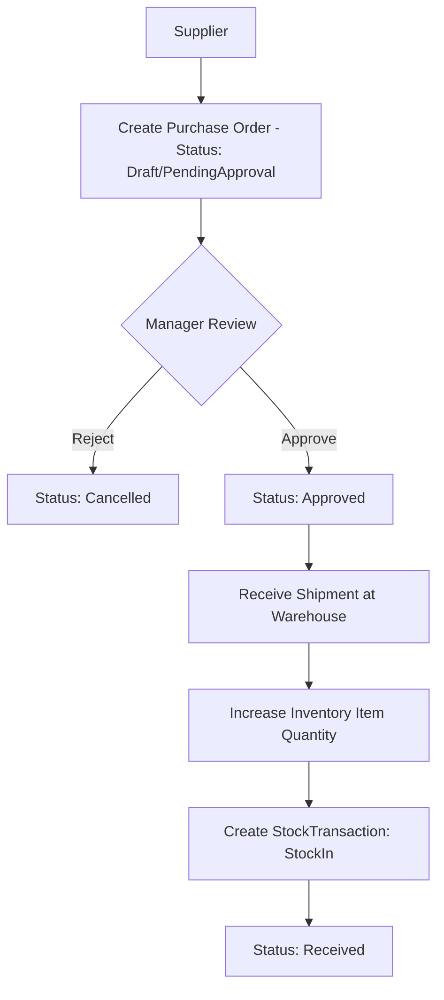
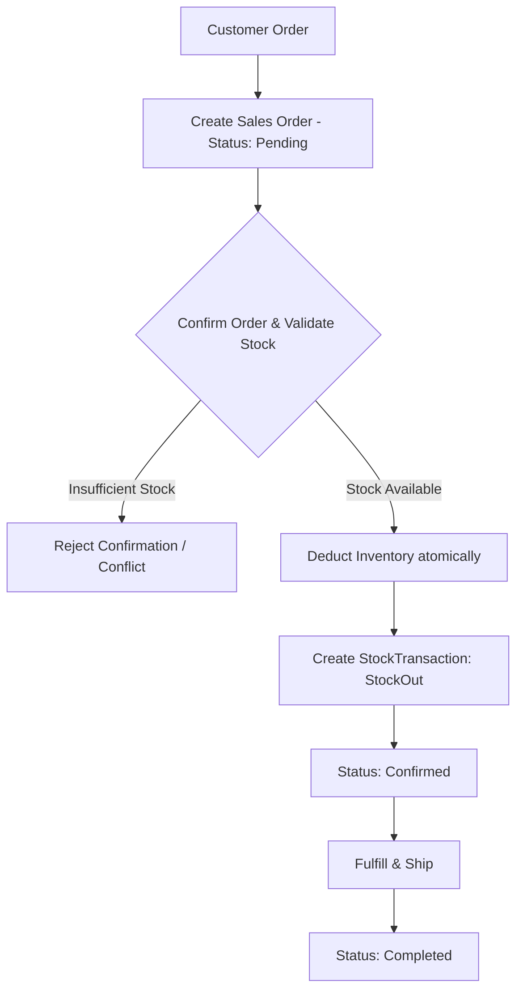
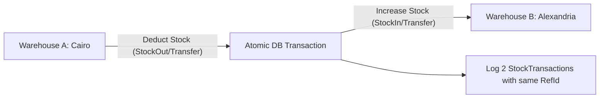
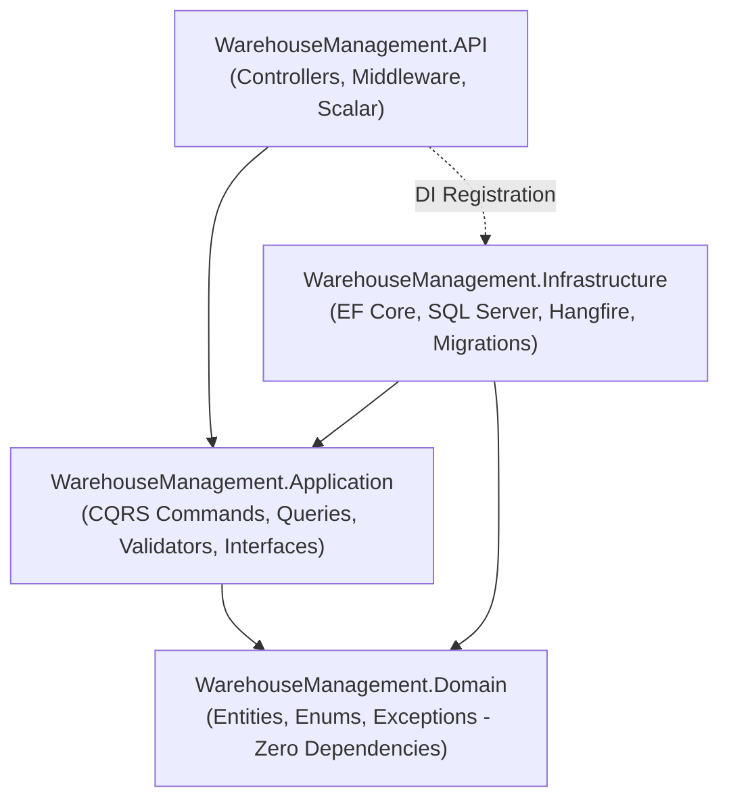

# 📦 Warehouse & Inventory Management System — Master Engineering Walkthrough & Mentor Guide

> **مرحباً بك يا بطل في مشروع التخرج الحقيقي للـ Backend!** 🚀  
> الدليل ده مش مجرد توثيق عادي لكود مكتوب، ده **Mentor Guide** مفصل معمول بأسلوب مهندس برمجيات كبير (Senior .NET Engineer) بيقعد جنبك ويفهمك كل سطر اتكتب ليه، والبدائل كانت إيه، وليه اختارنا القرار ده تحديداً، وازاي تشرحه بثقة في أي Technical Interview.

---

## 📑 جدول المحتويات (Table of Contents)

1. [نظرة عامة على المشروع (Project Overview)](#1-project-overview)
2. [المشكلة البيزنس وسيناريوهات النظام (Business Problem & Flows)](#2-business-problem--flows)
3. [المتطلبات الوظيفية وغير الوظيفية (Functional & Non-Functional Requirements)](#3-requirements)
4. [الأدوار والمستخدمين (Actors & Roles)](#4-actors--roles)
5. [المعمارية النظيفة (Clean Architecture) وقاعدة التبعية](#5-clean-architecture)
6. [مقارنات هندسية حاسمة: Why This and Not That?](#6-why-this-and-not-that)
7. [تصميم الـ Domain Model والـ Database ERD](#7-domain-model--database-erd)
8. [نمط CQRS و MediatR: فصل القراءة عن الكتابة](#8-cqrs--mediatr)
9. [مواصفات الفاليديشن ومفهوم Pipeline Behaviors](#9-validation--pipeline-behaviors)
10. [المعاملات المالية وإدارة المخزون (Database Transactions & Concurrency)](#10-transactions--concurrency)
11. [المهام الخلفية والمجدولة مع Hangfire (Background & Recurring Jobs)](#11-hangfire)
12. [التوثيق التفاعلي للـ API عبر Scalar و OpenAPI](#12-scalar--openapi)
13. [استراتيجية الـ Git والـ Feature Branches](#13-git-workflow)
14. [دليل أسئلة الإنترفيو المتقدمة (Interview Preparation)](#14-interview-preparation)
15. [شرح المرحلة الأولى بالتفصيل (Phase 1: Solution Setup)](#10-phase-1-walkthrough-solution-setup--clean-architecture-in-depth)
16. [شرح المرحلة الثانية بالتفصيل (Phase 2: Core Domain & Business Rules)](#11-phase-2-walkthrough-core-domain-entities--business-rules-in-depth)
17. [شرح المرحلة الثالثة بالتفصيل (Phase 3: Database & EF Core Persistence)](#12-phase-3-walkthrough-database--ef-core-persistence-in-depth)

---

## 1. Project Overview

النظام ده عبارة عن **Warehouse & Inventory Management System** حقيقي (Enterprise-grade). الهدف منه إدارة سلاسل الإمداد الداخلية للمؤسسات:
- توريد بضائع من موردين خارجيين (**Purchase Orders**).
- متابعة المخزون داخل مستودعات متعددة (**Warehouses & Multi-location Inventory**).
- نقل البضائع بين المستودعات بتدقيق كامل (**Stock Transfers & Transactions**).
- بيع البضائع للعملاء وخصم المخزون أوتوماتيكياً بعد الفحص (**Sales Orders & Stock Deduction**).
- كشف النواقص والتنبيه اليومي قبل نفاد المخزون (**Hangfire Background Jobs & Notifications**).

---

## 2. Business Problem & Flows

### 🛒 1. دورة التوريد والشراء (Purchase Order Flow)

> **قاعدة بيزنس ذهبية:** ممنوع استلام أي بضاعة (`Receive`) في المستودع إلا إذا كانت أمر الشراء معتمد رسمياً (`Approved`). مينفعش الموظف يستلم بضاعة أمر الشراء بتاعها لسه `PendingApproval`.

### 📦 2. دورة البيع وخروج البضاعة (Sales Order Flow)


### 🔄 3. حركة المخزون بين المستودعات (Stock Transfer Flow)

> **قاعدة بيزنس ذهبية:** عملية نقل المخزون لازم تكون **Atomic** جوه `IDbContextTransaction`. لو حصل خصم من القاهرة والكهربا قطعت أو حصل exception قبل ما نضيف في إسكندرية، يحصل **Rollback** فوراً والمخزون ميروحش في الهوا!

---

## 3. Requirements

### المتطلبات الوظيفية (Functional Requirements):
1. **Catalog Management**: منتجات وتصنيفات (Unique SKU, Price >= 0, Soft deletion/Active status).
2. **Partners**: موردين وعملاء مع تتبع السجلات التاريخية.
3. **Warehouses & Inventory**: تتبع كميات كل منتج في كل مستودع، كشف النواقص (MinimumStockLevel).
4. **Transactions Auditing**: كل حركة مخزن (`StockIn`, `StockOut`, `Transfer`) لازم تسجل سجل تاريخي `StockTransaction`.
5. **Orders Lifecycle**: أوامر شراء وبيع تتبع State Machine دقيقة ومحكمة.
6. **Automation**: فحص يومي للمخزون الناقص وتنبيه المديرين عبر وظائف خلفية.

### المتطلبات غير الوظيفية (Non-Functional Requirements):
1. **Clean Code & Maintainability**: الالتزام بالـ Clean Architecture وفصل الاهتمامات.
2. **ACID Transactions & Data Integrity**: منع الأخطاء الناتجة عن الـ Concurrency ونقص المخزون.
3. **High Security**: تأمين الـ API بـ JWT و Role-based Access Control (RBAC).
4. **Thin Controllers**: الـ Controller مبيعملش أي logic نهائي، مجرد وسيط للـ MediatR.
5. **Robust Centralized Error Handling**: منع خروج Stack traces للمستخدمين وتوحيد صيغ الـ Errors.

---

## 4. Actors & Roles

| الـ Role | الصلاحيات الأساسية |
|---|---|
| **Admin** | إدارة المستخدمين، إدارة المنتجات، التصنيفات، المستودعات، والموردين. |
| **WarehouseManager** | إدارة المخزون، الموافقة على أوامر الشراء (`Approve`), الاطلاع على التقارير والنواقص. |
| **WarehouseStaff** | إدخال حركات المخزون المسموحة، استلام البضائع لأوامر الشراء المعتمدة (`Receive`). |

---

## 5. Clean Architecture



### 🧠 القاعدة الذهبية: Dependency Inversion Rule
"الاتجاه دايمًا من الخارج للداخل. الطبقات الداخلية لا تعلم أي شيء عن الطبقات الخارجية."
- الـ **Domain** حر تماماً، لا يعرف Entity Framework، ولا يعرف SQL Server، ولا يعرف HTTP.
- الـ **Application** بتتعامل مع الداتابيز عن طريق **Interfaces** (عقود) زي `IApplicationDbContext` أو `INotificationService`.
- الـ **Infrastructure** هي اللي بتركب وتنفذ العقود دي.

---

## 6. Why This and Not That? (مقارنات تقنية وهندسية)

### ❓ 1. ليه استخدمنا Clean Architecture ومستخدمناش 3-Tier العادية؟
- **ما هي؟**: تقسيم السيستم لطبقات تركز على الـ Business Logic أولاً وليس على الداتابيز.
- **ليه مفيدة في الحقيقة؟**: في الـ 3-Tier التقليدية، الـ Business Layer بتبقى معتمدة على الـ Data Access Layer (EF Core). فلو اتغير الـ ORM أو طريقة التخزين، الـ Business Logic كله بيتأثر. الـ Clean Architecture بتعكس الاتجاه (Dependency Inversion)، وده بيخلي الـ Domain معزول وقابل للاختبار بنسبة 100% بدون أي داتابيز حقيقية.
- **البديل؟**: 3-Tier Architecture أو N-Tier.
- **ليه رفضنا البديل؟**: التماسك العالي والـ Coupling الشديد بين الـ Business Logic والداتابيز، وصعوبة كتابة Unit Tests نقية بدون Mocking معقد لمكتبات الـ ORM.
- **في الإنترفيو**: "Clean Architecture isolates domain rules from infrastructure concerns, making the core enterprise logic testable, maintainable, and independent of external frameworks."

### ❓ 2. ليه استخدمنا CQRS + MediatR بدل Traditional Service Classes؟
- **ما هي؟**: CQRS تعني فصل عمليات القراءة (Queries) عن عمليات التعديل (Commands). واستخدام MediatR بيخلي الـ Controller يبعت Request object وميعرفش مين بينفذه.
- **ليه مفيدة في الحقيقة؟**: في المشاريع الكبيرة، الـ `ProductService` التقليدي بيتحول لـ God Class فيه 40 ميثود، و20 Dependencies محقونة في الـ Constructor. أي تعديل في سطر بيعمل Merge Conflict لكل التيم! مع CQRS، كل ميزة (Feature) ليها فايل مستقل: `AddStockCommand` و `AddStockCommandHandler`.
- **البديل؟**: Service Layer عادي (`IInventoryService`, `IProductService`).
- **ليه رفضنا البديل هنا؟**: لمنع تضخم الـ Services، ولتطبيق مبدأ المسؤولية الفردية (Single Responsibility Principle) بدقة، وتسهيل عمل Pipeline Behaviors للفاليديشن واللوجنج.
- **بالعربي البلدي**: "لو كلنا شغالين في نفس الـ Service كلاس، أي commit هتعمل conflict، ولو ميثود باظت الـ Service كلها بتتهز. مع MediatR، كل Command في علبة لوحده مقفولة عليه."

### ❓ 3. ليه FluentValidation مع PipelineBehavior بدل DataAnnotations؟
- **ما هي؟**: عمل كلاس فاليديشن منفصل (`CreateProductCommandValidator`) بيشتغل أوتوماتيكياً قبل ما الكوماند يوصل للـ Handler عبر `ValidationBehavior`.
- **ليه مفيدة في الحقيقة؟**: الـ DataAnnotations بتلوث الـ DTOs بـ Attributes وبتعجز لما تكون محتاج Async validation (زي إنك تسأل الداتابيز هل الـ SKU ده موجود قبل كده ولا لأ).
- **البديل؟**: `[Required]`, `[MaxLength]` على الـ DTO أو كتابة `if (string.IsNullOrEmpty)` جوه الـ Controller/Handler.
- **ليه رفضنا البديل؟**: الفصل النظيف للمسؤوليات ومنع تكرار كود التحقق في كل Controller.

### ❓ 4. ليه Hangfire للـ Background Jobs بدل Task.Run أو HostedService؟
- **ما هي؟**: محرك مهام خلفية احترافي بيخزن الـ Jobs في الـ SQL Server ويشغلها بره الـ HTTP Request Cycle.
- **ليه مفيدة في الحقيقة؟**: لو استخدمت `Task.Run` والسيرفر اتعمله Restart أو حصل Crash، التاسك هتضيع للأبد! Hangfire بيضمن **Guaranteed Execution**: بيحفظ المهمة في جدول داتابيز، بيعيد المحاولة لو فشلت (Exponential Backoff)، وفيه لوحة تحكم Dashboard ممتازة لرؤية المهام الفاشلة والناجحة.
- **البديل؟**: `IHostedService` / `BackgroundService` مع In-memory Queue، أو `Quartz.NET`.
- **ليه رفضنا البديل؟**: الـ In-memory بتضيع البيانات عند انقطاع الكهرباء/الريستارت، و Quartz.NET إعداده معقد ومفيهوش Dashboard جاهز ومجاني وسريع زي Hangfire.

### ❓ 5. ليه Scalar بدل Swagger UI التقليدي؟
- **ما هي؟**: أداة جيل جديد لعرض وتجربة الـ OpenAPI specs.
- **ليه مفيدة في الحقيقة؟**: واجهة سريعة وعصرية جداً، أسهل في تجربة الـ JWT Bearer Authentication، وتوفر كود جاهز لكل لغات البرمجة لاستدعاء الـ Endpoint بضغطة زر.
- **البديل؟**: Swashbuckle Swagger UI.
- **ليه تم التفضيل؟**: مايكروسوفت نفسها في .NET 9 شالت الاعتماد الافتراضي على Swashbuckle لصالح OpenAPI المباشر و Scalar كأداة عصرية خفيفة وأقوى.

---

## 7. Domain Model & Entities Breakdown

### 1. `Product`
- `Id` (Guid / int)
- `Name` (nvarchar(150))
- `SKU` (nvarchar(50), Unique Index)
- `Price` (decimal(18,2) >= 0)
- `MinimumStockLevel` (int >= 0)
- `CategoryId` (FK)
- `IsActive` (bool)

### 2. `InventoryItem`
- `Id`
- `WarehouseId` (FK)
- `ProductId` (FK)
- `Quantity` (int >= 0)
- `ReservedQuantity` (int >= 0)
- *Unique Constraint*: (`WarehouseId`, `ProductId`)

### 3. `StockTransaction`
- `Id`
- `ProductId` (FK)
- `WarehouseId` (FK)
- `ToWarehouseId` (FK nullable - for transfers)
- `Type` (Enum: StockIn, StockOut, Transfer)
- `Quantity` (int > 0)
- `ReferenceId` (nvarchar(100) - e.g. PO-10023, SO-50012)
- `Notes`
- `CreatedAt` (DateTimeOffset)
- `CreatedByUserId`

### 4. `PurchaseOrder` & `PurchaseOrderItem`
- States: `Draft` ➔ `PendingApproval` ➔ `Approved` ➔ `Received` (or `Cancelled`).
- Includes Items with unit prices and ordered quantities.

### 5. `SalesOrder` & `SalesOrderItem`
- States: `Pending` ➔ `Confirmed` ➔ `Completed` (or `Cancelled`).
- Validates stock at confirmation.

---

## 8. Database Transactions & Concurrency

### 💡 سيناريو واقعي: نقل بضاعة بين مستودعين (Stock Transfer)
تخيل بننقل 50 كرتونة من مستودع القاهرة لمستودع الإسكندرية:
1. لازم نفتح **Database Transaction**:
   ```csharp
   using var transaction = await _context.Database.BeginTransactionAsync(cancellationToken);
   ```
2. نقرأ مخزون القاهرة، نتأكد إنه >= 50.
3. نخصم 50 من القاهرة.
4. نضيف 50 في الإسكندرية.
5. نسجل حركتين في جدول الـ `StockTransactions`.
6. نعمل `await transaction.CommitAsync()`.
7. **لو حصل أي error في الخطوة 4 أو 5؟** الـ `catch` block هينفذ `RollbackAsync()` ويرجع كل حاجة زي ما كانت، ولا حبة رملة تنقص بالغلط!

---

## 9. Git Feature Branch Workflow

من أجل تنظيم العمل مثل الفرق الاحترافية (Senior Engineering Teams)، سنتبع نمط **Conventional Commits**:
- `feat(scope): short description`
- `fix(scope): fix description`
- `docs(scope): documentation update`
- `test(scope): adding unit/integration tests`

### الفروع المخططة للعمل:
1. `feat/01-solution-setup`: هيكل الـ Clean Architecture والمشاريع.
2. `feat/02-domain-core`: كلاسات الـ Entities والـ Enums والـ Business Exceptions.
3. `feat/03-persistence-efcore`: إعدادات الـ EF Core و SQL Server والـ Migrations.
4. `feat/04-auth-jwt`: الـ Authentication والـ Roles.
5. `feat/05-products-categories`: ميزات المنتجات والتصنيفات بـ CQRS.
6. `feat/06-suppliers-warehouses`: إدارة الموردين والمستودعات والـ Soft Delete.
7. `feat/07-inventory-stock`: حركات الإضافة والخصم والتحويل مع الـ Transactions.
8. `feat/08-purchase-orders`: دورة أوامر الشراء والاستلام.
9. `feat/09-sales-orders`: دورة أوامر البيع وخصم المخزون.
10. `feat/10-validation-pipeline`: الـ FluentValidation و Pipeline Behavior.
11. `feat/11-exception-handling`: معالجة الأخطاء المركزية ونماذج الـ Response.
12. `feat/12-hangfire-notifications`: الـ Background Jobs والتنبيهات.
13. `feat/13-recurring-jobs`: الفحص اليومي للنواقص.
14. `feat/14-scalar-docs`: توثيق الـ API بـ Scalar.
15. `feat/15-automated-tests`: الـ Unit Tests والـ Integration Tests.

---

*(سيتم تحديث هذا الدليل مع كل Feature نضيفها ليكون مرجعك الشامل النهائي!)*

---

## 10. Phase 1 Walkthrough: Solution Setup & Clean Architecture In-Depth

### 1. What are we doing? (ماذا نفعل؟)
قمنا بتهيئة بيئة المشروع كاملة وفق معايير الشركات العالمية (Enterprise Standards):
1. تهيئة مستودع Git مع ملف `.gitignore` متكامل للـ .NET.
2. إنشاء فرع عمل مخصص للميزة: `feat/01-solution-setup`.
3. إنشاء ملفات الـ Solution (`WarehouseManagement.sln` و `WarehouseManagement.slnx`).
4. تقسيم النظام إلى 4 مشاريع في مجلد `src` ومشروعين للاختبار في مجلد `tests`:
   - `WarehouseManagement.Domain` (Class Library - .NET 8)
   - `WarehouseManagement.Application` (Class Library - .NET 8)
   - `WarehouseManagement.Infrastructure` (Class Library - .NET 8)
   - `WarehouseManagement.API` (ASP.NET Core Web API مع Controllers - .NET 8)
   - `WarehouseManagement.UnitTests` (xUnit - .NET 8)
   - `WarehouseManagement.IntegrationTests` (xUnit - .NET 8)
5. ضبط الـ Project References الصارمة لمنع أي اختراق لقاعدة التبعية (The Dependency Inversion Rule).
6. تنظيف كافة ملفات القوالب الافتراضية (`Class1.cs` و `WeatherForecastController.cs`).

---

### 2. Why are we doing it? (لماذا نفعل ذلك؟)
المعمارية هي الأساس الذي يقوم عليه المبنى. لو بدأنا كل الكود في مشروع واحد (Monolithic project واحد فيه الـ Controllers بتكلم الـ DbContext مباشرة)، بعد شهرين النظام هيتحول لـ "Big Ball of Mud" (كتلة طين متشابكة). لو حاولت تغير شكل جدول في الداتابيز، الـ API كلها هتقع وتتعطل!

---

### 3. Why is this useful in a real backend? (فائدته في سوق العمل)
في الشركات الكبيرة:
- **توزيع المهام (Team Parallelism)**: مطور يقدر يشتغل على الـ Domain والـ Business Logic، بينما مطور ثاني شغال على الـ Infrastructure والـ SQL Server بدون ما يعطلوا بعض.
- **عزل التبعيات (Dependency Isolation)**: لو ظهرت ثغرة أمنية أو تحديث في مكتبة الـ ORM، التأثير محصور فقط في الـ Infrastructure دون المساس بالبيزنس.

---

### 4. Why did we choose this approach? (لماذا هذا التوجه تحديداً؟)
اخترنا **Clean Architecture** (المعروفة أيضاً بـ Onion Architecture أو Hexagonal Ports & Adapters) لأنها تضع الـ **Domain في المركز المطلق**. المشاريع مقسمة هكذا:
```
API ──► Application ──► Domain ◄── Infrastructure
```
لاحظ السهمين: كل من `Application` و `Infrastructure` يشير إلى `Domain`. الـ Domain لا يشير إلى أي مشروع آخر نهائياً!

---

### 5. What alternatives exist? (ما هي البدائل؟)
1. **Single Project Web API**: وضع كل الكلاسات والـ DbContext والـ Controllers في نفس المشروع.
2. **Traditional 3-Tier Architecture**:
   - `Presentation` (API) ➔ `Business Logic Layer` (BLL) ➔ `Data Access Layer` (DAL).
3. **Vertical Slice Architecture**: تقسيم المشروع حسب الـ Features وليس حسب الطبقات الأفقية.

---

### 6. Why are we NOT using those alternatives here? (لماذا رفضنا البدائل؟)
- **Single Project**: مناسب فقط للـ Proof of Concept (POC) أو مشاريع الهواة، ومستحيل تطبيقه في نظام إدارة مستودعات ومخازن مؤسسي.
- **Traditional 3-Tier**: مشكلتها القاتلة أن الـ BLL تعتمد مباشرة على الـ DAL. يعني لو الـ DAL مستخدم Entity Framework، الـ BLL أصبحت مجبرة تعرف EF Core. لو قررت في المستقبل تستخدم Event Sourcing أو Dapper أو Mongo، هتضطر تعيد كتابة الـ Business Logic كله!
- **Vertical Slice**: نمط ممتاز، لكن Clean Architecture هي المعيار الصناعي الأكثر طلباً وشهرة في سوق عمل الـ .NET ومقابلات العمل (Interviews).

---

### 7. What problem does this approach solve? (ما المشكلة التي يحلها؟)
- **Coupling Hell (التشابك المميت)**: يمنع المطور بدون قصد من كتابة SQL Queries أو استخدام Entity Framework جوه الـ Controller أو جوه الـ Business Entity. الـ Compiler هيرفض أصلاً يعمل Build لأن الـ Project References مش سامحة بده!
- **Testability**: جعل البيزنس قابل للاختبار بنسبة 100% باستخدام Unit Tests بدون الحاجة لتشغيل SQL Server حقيقي.

---

### 8. What could go wrong? (ما الذي قد يفشل وكيف نتجنبه؟)
- **Circular Dependency (التبعية الدائرية)**: لو خليت مشروعيْن يشيروا لبعض (مثلاً `Domain` يشير لـ `Infrastructure` والعكس)، الـ Compiler هيطلع خطأ شهير: `Circular dependency detected`. تجنبنا ذلك عبر جعل `Domain` بمفرده في القاع.
- **Over-Abstraction**: عمل Interfaces لا فائدة منها لمجرد تطبيق النمط. نحن لن ننشئ أي Interface إلا إذا كانت تمثل عزل حقيقي (مثل `IApplicationDbContext`).

---

### 9. What should I remember for an interview? (ماذا تقول في الإنترفيو؟)
> **Interview Question**: "Explain the Dependency Rule in Clean Architecture."
>
> **الإجابة النموذجية**:
> "In Clean Architecture, source code dependencies must point inward, toward higher-level policies. The Domain layer sits at the core with zero external dependencies. The Application layer orchestrates business use cases and defines abstractions (interfaces). The Infrastructure layer implements these abstractions, and the API layer serves purely as an entry point. This guarantees that business logic remains completely independent of frameworks, databases, and UI concerns."

---

## 11. Phase 2 Walkthrough: Core Domain Entities & Business Rules In-Depth

### 1. What are we doing? (ماذا نفعل؟)
قمنا ببناء **قلب النظام (Domain Core)** داخل `WarehouseManagement.Domain`:
1. **Base & Auditable Classes**:
   - `BaseEntity`: يحمل الـ `Id` (الـ Identity).
   - `AuditableEntity`: يحمل `CreatedAt`, `CreatedBy`, `LastModifiedAt`, `LastModifiedBy` للتدقيق المحاسبي والتاريخي لكل صف.
2. **Domain Enums**:
   - `OrderStatus` (`Pending`, `Confirmed`, `Cancelled`, `Completed`).
   - `PurchaseOrderStatus` (`Draft`, `PendingApproval`, `Approved`, `Received`, `Cancelled`).
   - `StockTransactionType` (`StockIn`, `StockOut`, `Transfer`).
   - `UserRoleType` (`Admin`, `WarehouseManager`, `WarehouseStaff`).
3. **Rich Domain Entities (الكيانات الغنية بالبيزنس)**:
   - `Product`, `Category`, `Supplier`, `Customer`, `Warehouse`.
   - `InventoryItem`: إدارة الكميات، الكميات المحجوزة (`ReservedQuantity`)، والـ `RowVersion` للتحكم في التزامن (Concurrency).
   - `StockTransaction`: سجل الحركات غير القابل للتعديل، مع Factory Methods (`CreateStockIn`, `CreateStockOut`, `CreateTransfer`).
   - `PurchaseOrder` & `PurchaseOrderItem`: دورة الشراء، الاعتماد، والاستلام وحساب التكلفة.
   - `SalesOrder` & `SalesOrderItem`: دورة البيع، الفحص، التأكيد، والإكمال.
   - `User` & `Role`: إدارة بيانات المستخدمين والصلاحيات.
4. **Domain Invariant Exceptions**:
   - `DomainException` (Base class).
   - `InsufficientStockException`.
   - `InvalidOrderStateException`.
   - `NegativePriceException`.
   - `SameWarehouseTransferException`.
5. **Unit Tests**:
   - كتابة 11 اختبار وحدة في `WarehouseManagement.UnitTests` للتأكد من حماية الـ Invariants برمجياً.

---

### 2. Why are we doing it? (لماذا نفعل ذلك؟)
في الأنظمة الحقيقية، الـ **Domain Model هو الحارس الأول على صحة البيانات (Data Integrity)**.
لو سمحنا بـ "Anemic Domain Model" (مجرد كلاسات فاضية فيها getters و setters عامة `public set`)، أي مبرمج أو Controller في المستقبل يقدر يكتب:
```csharp
inventoryItem.Quantity = -50; // كارثة! مخزون بالسالب!
purchaseOrder.Status = PurchaseOrderStatus.Received; // استلم بضاعة من غير ما المدير يوافق!
```
لذلك، جعلنا الـ Setters خاصة (`private set`) وكل تعديل يمر من خلال **Domain Methods** تطبق قواعد البيزنس وترمي Exceptions واضحة لو حصل أي انتهاك!

---

### 3. Why is this useful in a real backend? (فائدته في سوق العمل)
- **منع الفساد المالي والمخزني (Preventing State Corruption)**: لا يمكن خروج بضاعة لا نملكها، ولا يمكن استلام شحنة لم يتم اعتماد أمر شرائها.
- **Single Source of Truth**: قاعدة البيزنس مكتوبة مرة واحدة داخل الـ Entity، وليس مكررة في 5 Controllers و 3 Services.
- **سهولة الاختبار (Instant Unit Testing)**: اختبرنا 11 سيناريو معقد في 60 مللي ثانية بدون تشغيل داتابيز وبدون تشغيل الـ API!

---

### 4. Why did we choose this approach? (لماذا هذا التوجه تحديداً؟)
اتبعنا أسلوب **Rich Domain Model** بدلاً من **Anemic Domain Model**:
- الكيان هو المسؤول عن حماية حالته (Encapsulation).
- استخدام الـ Private Setters والدوال الدلالية مثل:
  - `po.MarkAsReceived(staffUser)` بدلاً من `po.Status = 4`.
  - `inventory.ReserveStock(quantity)` بدلاً من حسابات يدوية مبعثرة.

---

### 5. What alternatives exist? (ما هي البدائل؟)
1. **Anemic Domain Model**: كلاسات مجرد DTOs بخصائص `{ get; set; }`، وكل العمليات الحسابية والـ if conditions مكتوبة جوه الـ Services أو الـ Handlers.
2. **Database Triggers / Stored Procedures**: وضع القواعد والتحقق جوه SQL Server مباشرة.

---

### 6. Why are we NOT using those alternatives here? (لماذا رفضنا البدائل؟)
- **Anemic Model**: كابوس في الصيانة! لو احتجت تغير شرط التأكيد، هتدور في المشروع كله على الأماكن اللي بتعدل `Status`.
- **Database Triggers**: صعبة جداً في الـ Version Control والـ Unit Testing، وتربط النظام بمحرك داتابيز محدد وتخفي الـ Business Rules عن أعين المطورين في الـ C#.

---

### 7. What problem does this approach solve? (ما المشكلة التي يحلها؟)
- **Invalid State Transitions**:
  - هل ينفع أمر شراء `Draft` يتحول فجأة لـ `Received`؟ **مستحيل!** الكود هيرمي `InvalidOrderStateException`.
  - هل ينفع نحول بضاعة من مستودع 1 لنفس مستودع 1؟ **مستحيل!** الكود هيرمي `SameWarehouseTransferException`.
  - هل ينفع نبيع منتج بسعر سالب؟ **مستحيل!** الكود هيرمي `NegativePriceException`.

---

### 8. What could go wrong? (ما الذي قد يفشل وكيف نتجنبه؟)
- **EF Core Parameterless Constructor**:
  - الـ EF Core يحتاج إلى Parameterless Constructor لإنشاء الكائنات عند قراءتها من الداتابيز.
  - **الحل**: أضفنا `protected EntityName() { }` في كل كيان ليستخدمها EF Core مع إجبار باقي المطورين على استخدام الـ Public Constructor أو الـ Factory Method.
- **Collections Mutation**:
  - لو عرّفنا الـ Items كـ `public List<SalesOrderItem> Items { get; set; }`، أي شخص من الخارج يقدر يعمل `order.Items.Clear()` ويتجاوز حساب الـ `TotalAmount`!
  - **الحل**: جعلنا الـ List داخلية `private readonly List<T> _items` وعرّفنا الخاصية العامة كـ `IReadOnlyCollection<T> Items => _items.AsReadOnly()`.

---

### 9. What should I remember for an interview? (ماذا تقول في الإنترفيو؟)
> **Interview Question**: "What is the difference between an Anemic Domain Model and a Rich Domain Model?"
>
> **الإجابة النموذجية**:
> "An **Anemic Domain Model** treats entities as plain data containers with getters and setters, pushing all business logic into service layers. This violates OOP encapsulation and leads to duplicated logic. In contrast, a **Rich Domain Model** encapsulates data alongside the business rules and state transitions that govern it (e.g., using private setters, factory methods, and domain invariant methods). This guarantees that an entity can never exist in an invalid state."

---

## 12. Phase 3 Walkthrough: Database & EF Core Persistence In-Depth

### 1. What are we doing? (ماذا نفعل؟)
قمنا بربط النظام بقاعدة بيانات حقيقية **SQL Server** باستخدام **Entity Framework Core 8**:
1. تثبيت الحزم:
   - `Microsoft.EntityFrameworkCore.SqlServer` في `Infrastructure`.
   - `Microsoft.EntityFrameworkCore.Design` في `Infrastructure` و `API`.
   - `Microsoft.EntityFrameworkCore` في `Application`.
2. إنشاء عقد قاعدة البيانات `IApplicationDbContext` داخل `WarehouseManagement.Application` لتمكين الـ Dependency Inversion.
3. بناء `ApplicationDbContext` داخل `WarehouseManagement.Infrastructure` مع ميزة **Automatic Auditing**: يقوم بتحديث `CreatedAt` و `LastModifiedAt` أوتوماتيكياً لكل كيان يرث `AuditableEntity`.
4. كتابة إعدادات **Fluent API** منفصلة لكل كيان في مجلد `Persistence/Configurations/`:
   - Unique Indexes على `SKU`, `Username`, `Email`, `OrderNumber`.
   - Composite Unique Index على `(WarehouseId, ProductId)` لمنع تكرار المنتج في نفس المستودع.
   - تفعيل `RowVersion` كـ **Optimistic Concurrency Token**.
   - ضبط سلوك الحذف `DeleteBehavior.Restrict` لحماية سجلات الحركات المالية والمخزنية من المسح العفوي.
   - تهيئة الأدوار الأساسية (Seed Data) لـ `Roles`.
5. توليد Migration باسم `InitialCreate` وتطبيقها فعلياً على قاعدة بيانات `WarehouseManagementDb` في SQL Server.

---

### 2. Why are we doing it? (لماذا نفعل ذلك؟)
في الـ Clean Architecture، طبقة الـ Application ومسؤولو الـ Use Cases (مثل Handlers) لا يجب أن يعرفوا أي تفاصيل عن نوع الداتابيز المستخدمة (سواء كانت SQL Server أو Oracle).
لذلك، جعلنا الـ Application تعتمد فقط على **Interface** اسمه `IApplicationDbContext`، بينما قامت الـ Infrastructure بتنفيذ هذا الـ Interface واستخدام EF Core و SQL Server تحت الغطاء.

---

### 3. Why is this useful in a real backend? (فائدته في سوق العمل)
- **Zero Framework Leakage**: كود الـ Application والـ Domain لا يحتوي على أي كود خاص بـ SQL Server أو Connection Strings.
- **Data Protection (حماية الحركات المالية)**: في المخازن، لو قمت بحذف مورد (`Supplier`)، من الكارثة أن يُحذف معه تاريخ أوامر الشراء المرتبطة به! ضبط `DeleteBehavior.Restrict` يمنع الـ Cascade Delete العشوائي ويجبر السيستم على الحفاظ على التاريخ المحاسبي كاملاً.
- **Concurrency Protection**: منع حدوث Race Conditions عندما يحاول عميلان شراء آخر قطعة في المخزن في نفس اللحظة عبر الـ `RowVersion`.

---

### 4. Why did we choose this approach? (لماذا هذا التوجه تحديداً؟)
1. **Fluent API بدلاً من DataAnnotations**:
   - DataAnnotations تلوث كلاسات الـ Domain بـ Attributes تابعة للداتابيز مثل `[Column(TypeName = "decimal(18,2)")]`، مما يكسر نقاء الـ Domain.
   - Fluent API تفصل الإعدادات تماماً داخل كلاسات مستقلة (`IEntityTypeConfiguration<T>`) في الـ Infrastructure.
2. **`IApplicationDbContext` بدلاً من Repository Pattern التقليدي لكل Entity**:
   - الـ EF Core في حد ذاته هو تطبيق عملي لنمط **Repository (DbSet) + Unit of Work (DbContext)**.
   - عمل Generic Repository سطحي فوق الـ EF Core (`IRepository<T>` يحتوي على `Add`, `Update`, `Delete`) هو Anti-pattern شائع يسمى **Over-Abstraction**، لأنه يحرمك من إمكانيات EF Core القوية مثل `AsNoTracking()`, `Include()`, والـ Projections بـ `Select()`.

---

### 5. What alternatives exist? (ما هي البدائل؟)
1. **Generic Repository & Unit of Work Layer فوق EF Core**: عمل `GenericRepository<T>` و `UnitOfWork` يغلف الـ DbContext.
2. **Dapper / Raw ADO.NET**: استخدام استعلامات SQL خام ومكتبة Micro-ORM خفيفة.

---

### 6. Why are we NOT using those alternatives here? (لماذا رفضنا البدائل؟)
- **Generic Repository فوق EF Core**: كما شرحنا، الـ DbContext هو بالفعل Unit of Work. إضافة طبقة Generic إضافية بدون داعٍ يضيف Boilerplate كود فقط بدون أي قيمة بيزنس حقيقية. (سنستخدم استراتيجية Repository مخصصة فقط إن وُجدت عملية بيزنس معقدة تتطلب ذلك).
- **Dapper**: ممتاز للـ High-performance Read Queries، لكن EF Core 8 أصبح سريعاً جداً، ويوفر Change Tracking، Migrations، وإدارة العلاقات أوتوماتيكياً وهو الخيار الأساسي لبيئات العمل الحديثة.

---

### 7. What problem does this approach solve? (ما المشكلة التي يحلها؟)
- **Concurrency Overselling (بيع بضاعة غير موجودة)**:
  - عبر `builder.Property(i => i.RowVersion).IsRowVersion()`، كل صف في `InventoryItems` يملك ختم زمني ثنائي `byte[]`.
  - إذا قرأ مستخدمان نفس المخزون وعدّلوه في نفس اللحظة، أول عملية تنجح، والعملية الثانية تفشل بـ `DbUpdateConcurrencyException` فوراً، مما يمنع بيع نفس السلعة مرتين!
- **Composite Unique Index**:
  - يضمن فيزيائياً داخل SQL Server ألا يوجد صفان يحملان نفس `WarehouseId` و `ProductId`.

---

### 8. What could go wrong? (ما الذي قد يفشل وكيف نتجنبه؟)
- **Cascade Delete Accidental Data Loss**:
  - الإعداد الافتراضي في EF Core للعلاقات الإجبارية هو `Cascade Delete`. لو حذف موظف مستودعاً، كانت كل المنتجات وحركات المخزن ستُحذف معه!
  - **الحل**: قمنا بضبط `DeleteBehavior.Restrict` صراحة على كل العلاقات الحساسة.
- **Decimals Truncation**:
  - لو لم تحدد `HasPrecision(18, 2)` للأسعار، SQL Server سيصدر تحذيراً وقد يقرّب الأرقام إلى خانتين غير دقيقتين. قمنا بضبط الدقة المالية لجميع حقول الأسعار والإجماليات.

---

### 9. What should I remember for an interview? (ماذا تقول في الإنترفيو؟)
> **Interview Question**: "Why use Fluent API over Data Annotations in Clean Architecture, and why is DbContext considered a Unit of Work?"
>
> **الإجابة النموذجية**:
> "In Clean Architecture, the Domain layer must remain pure and free of infrastructure concerns. Using Fluent API in the Infrastructure layer isolates database mappings (indexes, constraints, precision) from entity definitions. Furthermore, EF Core's `DbContext` inherently implements the **Unit of Work** pattern (coordinating multiple repository/DbSet operations within a single transaction during `SaveChangesAsync`), while `DbSet<T>` serves as the **Repository**. Wrapping EF Core in a generic repository often introduces unnecessary abstraction, hiding valuable capabilities like projections and async query streaming."

---


