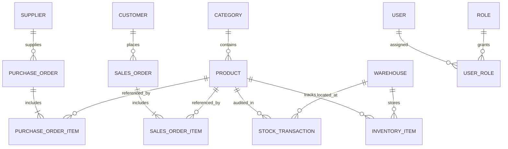

# Implementation Plan: Warehouse & Inventory Management System (Phase 0: Project Audit & Architectural Blueprint)

## Project Overview
A production-grade, enterprise-ready **Warehouse & Inventory Management System** built with **ASP.NET Core (.NET 8 LTS / .NET 9)**, adhering strictly to **Clean Architecture**, **CQRS with MediatR**, **Entity Framework Core**, **SQL Server**, **Hangfire**, and **Scalar**. 

This plan serves as the architectural foundation and mentorship roadmap, providing technical rigor alongside bilingual (English + Egyptian Arabic) pedagogical reasoning.

---

## 1. Project Audit & Current State Analysis

### 1.1 Environment & Tooling Audit
- **Working Directory**: `d:\.NET Projects\Warehouse & Inventory Management System` (Verified empty directory).
- **.NET SDK & Runtimes**: 
  - Installed SDK: `10.0.302`
  - Installed Runtimes: `Microsoft.AspNetCore.App 8.0.28`, `9.0.17`, `10.0.9/10`
  - **Decision**: Target **.NET 8.0 (LTS)** for enterprise long-term support and widest compatibility with ecosystem libraries (Hangfire, Scalar, MediatR, FluentValidation), or **.NET 9.0**. We recommend `.net8.0`.
- **Database Engine**:
  - `MSSQLSERVER` service is **Running** on `localhost`.
  - `MSSQLLocalDB` is also present.
  - **Decision**: Use SQL Server localhost (`Server=localhost;Database=WarehouseManagementDb;Trusted_Connection=True;TrustServerCertificate=True;`).
- **Version Control**:
  - Git is installed, but no repository is initialized yet.
  - Git initialization (`git init`) will be our first action upon phase approval.

---

## 2. Requirement Clarifications & Explicit Assumptions

> [!NOTE]
> In real-world enterprise engineering, requirements are rarely 100% complete upfront. Clarifying ambiguities before writing code prevents expensive rewrites.

### Identified Ambiguities & Working Assumptions:
1. **Customer Representation**:
   - *Ambiguity*: Sales orders relate to customers, but a dedicated `Customer` entity was not explicitly enumerated in section 5.
   - *Assumption*: We will define a `Customer` entity (`Id`, `Name`, `Email`, `PhoneNumber`, `Address`, `IsActive`) or value object to ensure realistic sales order processing.
2. **Stock Reservation vs Direct Deduction**:
   - *Ambiguity*: When a Sales Order is `Pending` vs `Confirmed`, should stock be immediately deducted or reserved first?
   - *Assumption*: To adhere to real-world warehouse practices, when a Sales Order is `Confirmed`, stock is verified and deducted via a `StockTransaction` (StockOut). We will support `QuantityOnHand` and `AllocatedQuantity` (or reserved) on `InventoryItem` to prevent overselling race conditions.
3. **Authentication Mechanism**:
   - *Ambiguity*: ASP.NET Core Identity vs Custom Lightweight Identity.
   - *Assumption*: A clean, domain-driven custom User/Role model with hashed passwords (BCrypt/Argon2/PBKDF2 via `IPasswordHasher`) and JWT claims, keeping the Domain completely free of external Microsoft Identity packages, while keeping total control over User entities.

---

## 3. Architecture Blueprint: Clean Architecture

### 3.1 The Dependency Rule (قاعدة اتجاه الاعتماديات)
```
          ┌─────────────────────────┐
          │   Presentation / API    │
          └────────────┬────────────┘
                       │ references
                       ▼
          ┌─────────────────────────┐
          │    Application Layer    │
          │ (CQRS, MediatR, DTOs)   │
          └────────────┬────────────┘
                       │ references
                       ▼
          ┌─────────────────────────┐
          │      Domain Layer       │
          │  (Entities, Enums,      │
          │   Business Exceptions)  │
          └─────────────────────────┘
                       ▲
                       │ implements Application interfaces
          ┌────────────┴────────────┐
          │   Infrastructure Layer  │
          │ (EF Core, SQL, Hangfire)│
          └─────────────────────────┘
```

### 3.2 Projects & Layer Responsibilities

1. **`WarehouseManagement.Domain`**:
   - **Zero external dependencies** (no EF Core, no MediatR, no ASP.NET).
   - Core Entities, Value Objects, Domain Enums, Domain Exceptions, Domain Events.
   - *Egyptian Arabic*: "الـ Domain ده قلب السيستم. مفيهوش أي تكنولوجي ولا database ولا web framework. لو غيرنا الـ database بكره من SQL Server لـ Mongo أو غيرنا الـ API لـ gRPC، الـ Domain هيفضل زي ما هو من غير تغيير حرف واحد."

2. **`WarehouseManagement.Application`**:
   - Depends only on **Domain**.
   - Contains CQRS Commands, Queries, Handlers, FluentValidation Validators, Pipeline Behaviors, DTOs, Mapping profiles, Service Interfaces (`IApplicationDbContext`, `INotificationService`, `IJwtTokenGenerator`, `ICurrentUserService`).
   - *Egyptian Arabic*: "دي طبقة الـ Use Cases. هي المايسترو اللي بينظم: الترافيك دخل، هينادي على الـ Domain، يشوف الـ business logic، ويطلب من الـ Infrastructure تحفظ أو تبعت notifications عبر interfaces."

3. **`WarehouseManagement.Infrastructure`**:
   - Depends on **Application** (implements its interfaces) and **Domain**.
   - Contains EF Core `ApplicationDbContext`, Entity Configurations (Fluent API), Migrations, Repositories / Unit of Work, Hangfire job implementations, Notification services, Password hashing, JWT token generation.
   - *Egyptian Arabic*: "دي العضلات اللي بتنفذ الشغل الحقيقي مع العالم الخارجي: SQL Server، الـ Hangfire background engine، الـ Email server."

4. **`WarehouseManagement.API`**:
   - The entry point (ASP.NET Core Web API).
   - Depends on **Application** and **Infrastructure** (purely for DI composition in `Program.cs`).
   - Thin Controllers dispatching MediatR commands/queries.
   - Global Exception Handling Middleware, Scalar UI configuration, JWT Authentication setup, Serilog / Structured Logging.
   - *Egyptian Arabic*: "دي البوابة الخارجية. الـ Controllers هنا دورها رفيع جداً (Thin Controllers): تستقبل الـ HTTP Request، تبعته للـ Mediator، وترجع الـ HTTP Response المناسب."

5. **`tests/WarehouseManagement.UnitTests` & `tests/WarehouseManagement.IntegrationTests`**:
   - Testing domain invariants, command handlers, pipeline behaviors, inventory concurrency, and API endpoints using WebApplicationFactory & in-memory/test database.

---

## 4. Domain Model & Entity Relationship Specification



### Core Entities & Key Fields:
- **`Product`**: `Id`, `Name`, `SKU` (Unique Index), `Description`, `Price` (decimal >= 0), `MinimumStockLevel`, `CategoryId`, `IsActive`, `CreatedAt`, `UpdatedAt`.
- **`Category`**: `Id`, `Name` (Unique), `Description`, `IsActive`.
- **`Supplier`**: `Id`, `Name`, `ContactPerson`, `Email`, `PhoneNumber`, `Address`, `IsActive`.
- **`Warehouse`**: `Id`, `Name`, `Location`, `IsActive`, `CreatedAt`.
- **`InventoryItem`**: `Id`, `WarehouseId`, `ProductId`, `Quantity` (int >= 0), `ReservedQuantity` (int >= 0), `RowVersion` (concurrency token). Unique composite index (`WarehouseId`, `ProductId`).
- **`StockTransaction`**: `Id`, `ProductId`, `WarehouseId`, `ToWarehouseId` (nullable, for transfers), `Type` (`StockIn`, `StockOut`, `Transfer`), `Quantity` (int > 0), `ReferenceId` (e.g. PO number, SO number), `Notes`, `CreatedByUserId`, `CreatedAt`.
- **`PurchaseOrder`**: `Id`, `OrderNumber` (Unique), `SupplierId`, `Status` (`Draft`, `PendingApproval`, `Approved`, `Received`, `Cancelled`), `TotalAmount`, `ApprovedByUserId`, `ApprovedAt`, `ReceivedAt`, `Items` (List).
- **`PurchaseOrderItem`**: `Id`, `PurchaseOrderId`, `ProductId`, `Quantity`, `UnitPrice`, `ReceivedQuantity`.
- **`SalesOrder`**: `Id`, `OrderNumber` (Unique), `CustomerId`, `Status` (`Pending`, `Confirmed`, `Cancelled`, `Completed`), `TotalAmount`, `ConfirmedAt`, `CompletedAt`, `Items` (List).
- **`SalesOrderItem`**: `Id`, `SalesOrderId`, `ProductId`, `Quantity`, `UnitPrice`.
- **`User` & `Role`**: `Id`, `Username`, `Email`, `PasswordHash`, `Role` (`Admin`, `WarehouseManager`, `WarehouseStaff`), `IsActive`.

---

## 5. Architectural & Technical Decisions ("Why This and Not That?")

### 1. CQRS (Command Query Responsibility Segregation) + MediatR
- **What**: Separating operations that read data (Queries) from operations that mutate state (Commands). Using MediatR as an in-process mediator to decouple HTTP controllers from domain handlers.
- **Why**: 
  - Prevents bloated "God Services" (`InventoryService` with 40 methods).
  - High cohesion: Each feature has its own Command, Handler, and Validator in a single slice.
  - SRP (Single Responsibility Principle) & Open/Closed Principle: Adding a new use case requires adding a new handler file without touching existing handlers.
- **Alternatives**: Traditional monolithic Service classes (`IProductService`).
- **Why NOT the alternative**: Monolithic services become massive dumping grounds, lead to merge conflicts, high coupling, and complicate unit testing because every test needs to mock a service with 20 dependencies.
- **Egyptian Arabic**: "الـ Service التقليدي بعد 6 شهور شغل بيبقى فيه 3000 سطر ومليون dependency. في الـ CQRS، كل عملية ليها فايل خاص بيها (Handler). عاوز تعدل في `AddStock`؟ بتفتح `AddStockCommandHandler` بس، وانت مطمن إنك مش بتكسر أي حاجة تانية في السيستم."

### 2. Validation with FluentValidation + MediatR PipelineBehavior
- **What**: Centralized request validation interceptor executed automatically before the Handler runs.
- **Why**: Keeps Handlers clean of defensive validation code. If input fails validation, a `ValidationException` is thrown before touching the database or domain logic.
- **Alternatives**: DataAnnotations on DTOs, or manual `if (!validator.IsValid)` checks inside controllers/handlers.
- **Why NOT the alternative**: DataAnnotations pollute DTOs, cannot easily do cross-property validation or dependency-injected asynchronous checks (e.g. checking SKU uniqueness against DB), and manual checks duplicate code across endpoints.
- **Egyptian Arabic**: "الـ Pipeline Behavior ده عامل زي الـ Middleware بس جوه MediatR. قبل ما الـ Command يوصل للـ Handler بتاعه، بيعدي على محطة تفتيش (ValidationBehavior). لو البيانات ناقصة أو الـ SKU مكرر، يرجع Bad Request فوراً وميسمحش للكود يكمل."

### 3. Hangfire for Background Processing
- **What**: Out-of-process/persistent background task queue with SQL Server storage for notifications and scheduled jobs (daily low-stock audit).
- **Why**: Durable execution. If the web server crashes or restarts, enqueued jobs are preserved in SQL Server and retried with exponential backoff. Provides a real-time web dashboard.
- **Alternatives**: ASP.NET Core `BackgroundService` / `IHostedService` with in-memory `Channel<T>`, Quartz.NET.
- **Why NOT the alternative**: In-memory queues lose all pending emails/notifications if the server restarts. Quartz.NET is powerful but has a steeper configuration curve and lacks Hangfire's built-in interactive dashboard.
- **Egyptian Arabic**: "لو العميل أكد أوردر، من الغلط نخليه يستنى 3 ثواني على ما نبعت إيميل أو notification. والأخطر: لو السيرفر عمل Restart أثناء إرسال الإيميل، الإيميل هيضيع لو شغالين In-Memory. Hangfire بيسجل الـ Job في الداتابيز، وينفذها في الـ background، ولو فشلت بيعيد المحاولة أوتوماتيك."

### 4. Scalar instead of Swagger UI
- **What**: Modern, interactive OpenAPI document visualizer with built-in client generation and sleek design.
- **Why**: Faster, cleaner API testing interface, superior interactive Bearer token testing, and active support in modern .NET ecosystems (.NET 8/9/10).
- **Egyptian Arabic**: "Swagger UI بقى شكله قديم وبطيء شوية. Scalar بيقرأ نفس مواصفات الـ OpenAPI بس بيقدّم UI حديث وسريع جداً، وبيسهل تجربة الـ JWT Authentication واختبار الـ Endpoints."

---

## 6. Git Branching Strategy & Workflow

We will follow a strict **Feature Branch Workflow** using **Conventional Commits**:
- `main`: Production-ready, stable releases.
- `feat/feature-name`: Dedicated branch per logical feature.
- Commit convention: `type(scope): description` (e.g., `feat(domain): define product and category entities`).
- Each feature milestone will provide:
  1. Branch name
  2. Commit message
  3. PR title & description
  4. Changed files summary
  5. Test execution results
  6. Next recommended step

---

## 7. Phased Implementation Roadmap

- [ ] **Phase 0: Project Audit, Architecture Blueprint & Initial Documentation (Current Step)**
  - Initialize Git repository and `.gitignore`.
  - Create initial `WALKTHROUGH.md` containing architectural foundation, domain models, and decision logs.
- [ ] **Phase 1: Clean Architecture Solution Setup**
  - Create solution `WarehouseManagement.sln`.
  - Create projects: `Domain`, `Application`, `Infrastructure`, `API`, `UnitTests`, `IntegrationTests`.
  - Configure project references enforcing the dependency rule.
- [ ] **Phase 2: Core Domain Entities & Business Rules**
  - Implement base entities (`BaseEntity`, `AuditableEntity`).
  - Implement domain entities: `Product`, `Category`, `Supplier`, `Warehouse`, `InventoryItem`, `StockTransaction`, `PurchaseOrder`, `PurchaseOrderItem`, `SalesOrder`, `SalesOrderItem`, `User`, `Role`.
  - Implement domain enums & domain exceptions.
- [ ] **Phase 3: Database & EF Core Persistence**
  - Setup `ApplicationDbContext` and Fluent API Configurations.
  - Setup Unit of Work / Repository abstractions where beneficial.
  - Implement and apply initial database migration to SQL Server.
- [ ] **Phase 4: JWT Authentication & Role-Based Authorization**
  - Implement password hashing, JWT generator, auth handlers, and roles (`Admin`, `WarehouseManager`, `WarehouseStaff`).
  - Secure API endpoints with `[Authorize(Roles = "...")]`.
- [ ] **Phase 5: Products & Categories Feature (CQRS + Validation)**
  - Implement Commands & Queries (Create, Update, Delete, GetById, GetAll, Search).
  - Business rules: SKU uniqueness, non-negative price, category deletion constraints.
- [ ] **Phase 6: Suppliers & Warehouses Feature**
  - Implement Supplier & Warehouse management with Soft Delete / Deactivation.
- [ ] **Phase 7: Inventory Management & Stock Operations**
  - Implement Add Stock, Remove Stock, Transfer Stock.
  - Atomic transactions, concurrency control, mandatory `StockTransaction` audit logging.
- [ ] **Phase 8: Purchase Order Flow**
  - Create PO -> Pending Approval -> Approve -> Receive (increase inventory atomically).
  - Enforce status transition state machine.
- [ ] **Phase 9: Sales Order Flow**
  - Create SO -> Confirm (stock availability check & deduction) -> Complete.
  - Transactional rollback on stock exhaustion.
- [ ] **Phase 10: MediatR Pipeline Behaviors & Centralized Validation**
  - `ValidationBehavior`, `LoggingBehavior`, FluentValidation integration.
- [ ] **Phase 11: Centralized Exception Handling & Standard API Responses**
  - Global Exception Middleware returning RFC 7807 / standard envelope responses with correct HTTP status codes.
- [ ] **Phase 12: Hangfire Background Processing & Notifications**
  - Hangfire configuration with SQL Server storage.
  - Event-driven background notifications (PO approved, SO confirmed, Low stock).
- [ ] **Phase 13: Recurring Job: Daily Low Stock Check**
  - Configure `RecurringJob.AddOrUpdate` with daily Cron schedule.
- [ ] **Phase 14: Scalar & OpenAPI Setup**
  - Configure Scalar endpoint at `/scalar` with JWT Bearer support.
- [ ] **Phase 15: Unit Testing & Integration Testing**
  - Test business rules, inventory operations, order state machines, concurrency, and API integration.
- [ ] **Phase 16: Final Review & Interview-Readiness Preparation**
  - Complete `WALKTHROUGH.md` with all 50 topics and interview Q&A.
  - Complete `README.md`.

---

## 8. Verification & Validation Plan
- **Build & Compilations**: Verify all projects compile with zero warnings using `dotnet build`.
- **Database Migrations**: Verify EF Core migrations apply cleanly to SQL Server using `dotnet ef database update`.
- **Automated Tests**: Execute `dotnet test` covering unit and integration scenarios.
- **Manual Verification**: Test endpoints through Scalar at `/scalar` and monitor background jobs in `/hangfire`.
